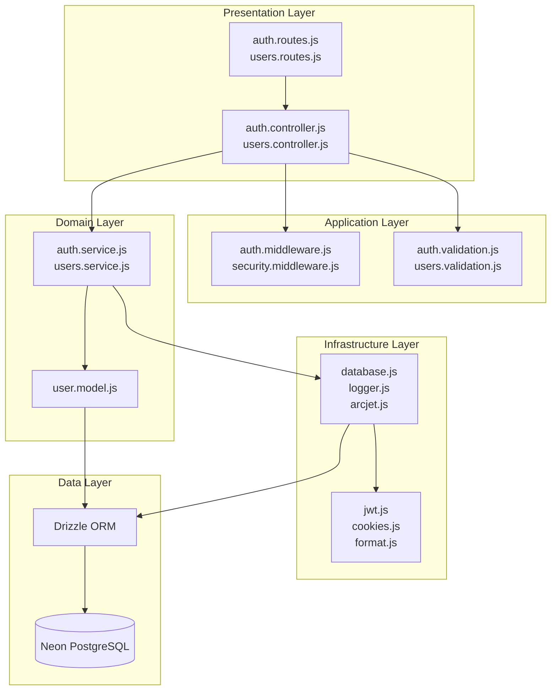

# 4. Complete Repository Analysis

## Repository Tree

```
acquisitions/
├── .dockerignore               # Excludes files from Docker build context
├── .env                        # Environment variables (⚠️ committed with secrets)
├── .github/
│   └── workflows/
│       ├── docker-build-and-push.yml  # CI: Multi-arch Docker build + push
│       ├── lint-and-format.yml        # CI: ESLint + Prettier check
│       └── tests.yml                  # CI: Jest test suite
├── .gitignore                  # Git exclusion rules
├── .prettierignore             # Prettier exclusion rules
├── .prettierrc                 # Prettier config (single quotes, 2 spaces, LF)
├── DOCKER_SETUP.md             # Comprehensive Docker setup guide
├── Dockerfile                  # Multi-stage Docker build
├── README.md                   # Project README
├── WARP.md                     # Warp.dev terminal guidance config
├── coverage/                   # Jest coverage reports
├── docs/                       # Documentation (this directory)
├── docker-compose.dev.yml      # Dev environment composition
├── docker-compose.prod.yml     # Prod environment composition
├── drizzle/
│   ├── 0000_happy_bedlam.sql   # Initial migration: CREATE users table
│   └── meta/                   # Drizzle migration metadata
├── drizzle.config.js           # Drizzle Kit configuration
├── eslint.config.js            # ESLint flat config
├── jest.config.mjs             # Jest configuration
├── logs/
│   ├── combined.log            # All application logs
│   └── error.lg                # Error-level logs only
├── package-lock.json           # Dependency lock file
├── package.json                # Project manifest, scripts, dependencies
├── prompt/
│   └── starter.md              # AI prompt template for docs generation
├── public/
│   └── readme/                 # README images (hero, thumbnails)
├── scripts/
│   ├── dev.sh                  # Local dev startup script
│   └── prod.sh                 # Production startup script
├── src/
│   ├── index.js                # Entry point: loads dotenv, starts server
│   ├── server.js               # Server boot: listens on PORT
│   ├── app.js                  # Express app: middleware setup, route mounting
│   ├── config/
│   │   ├── arcjet.js           # Arcjet security config
│   │   ├── database.js         # Neon/Drizzle connection
│   │   └── logger.js           # Winston logger config
│   ├── controllers/
│   │   ├── auth.controller.js  # Auth request handlers
│   │   └── users.controller.js # User CRUD request handlers
│   ├── middleware/
│   │   ├── auth.middleware.js   # JWT verification + role check
│   │   └── security.middleware.js  # Arcjet rate limit/bot/shield
│   ├── models/
│   │   └── user.model.js       # Drizzle schema: users table
│   ├── routes/
│   │   ├── auth.routes.js      # Auth route definitions
│   │   └── users.routes.js     # User route definitions
│   ├── services/
│   │   ├── auth.service.js     # Auth business logic
│   │   └── users.service.js    # User business logic
│   ├── utils/
│   │   ├── cookies.js          # Cookie helper (set, get, clear)
│   │   ├── format.js           # Validation error formatter
│   │   └── jwt.js              # JWT sign/verify helper
│   └── validations/
│       ├── auth.validation.js  # Zod schemas for auth
│       └── users.validation.js # Zod schemas for user CRUD
└── tests/
    └── app.test.js             # Integration tests (3 cases)
```

## File Responsibilities

### Entry Points
| File | Responsibility | Evidence |
|------|---------------|----------|
| `src/index.js` | Loads env vars, imports server | `import 'dotenv/config'; import './server.js'` |
| `src/server.js` | Starts Express on PORT (default 3000) | `app.listen(PORT, ...)` |
| `src/app.js` | Configures middleware, mounts routes, exports Express app | All `app.use()` calls |

### Configuration
| File | Responsibility | Evidence |
|------|---------------|----------|
| `src/config/database.js` | Establishes Neon PostgreSQL connection via Drizzle | `neon(process.env.DATABASE_URL)`, `drizzle(sql)` |
| `src/config/logger.js` | Configures Winston with file + console transports | `winston.createLogger(...)` |
| `src/config/arcjet.js` | Configures Arcjet rules (shield, bot, rate limit) | `arcjet({ key: ..., rules: [...] })` |

### Controllers (Request Handlers)
| File | Responsibility | Evidence |
|------|---------------|----------|
| `src/controllers/auth.controller.js` | Handles signup, signIn, signOut requests | `export const signup = async (req, res, next) => ...` |
| `src/controllers/users.controller.js` | Handles user CRUD requests | `export const fetchAllUsers = async (req, res, next) => ...` |

### Middleware
| File | Responsibility | Evidence |
|------|---------------|----------|
| `src/middleware/auth.middleware.js` | JWT verification + role-based authorization | `authenticateToken`, `requireRole` |
| `src/middleware/security.middleware.js` | Arcjet rate limiting, bot detection, shield | Role-aware sliding window rate limits |

### Models
| File | Responsibility | Evidence |
|------|---------------|----------|
| `src/models/user.model.js` | Drizzle ORM table definition for `users` | `pgTable('users', { ... })` |

### Routes
| File | Responsibility | Evidence |
|------|---------------|----------|
| `src/routes/auth.routes.js` | Maps auth endpoints to controllers | `router.post('/sign-up', signup)` |
| `src/routes/users.routes.js` | Maps user endpoints with auth middleware | `router.get('/', authenticateToken, fetchAllUsers)` |

### Services (Business Logic)
| File | Responsibility | Evidence |
|------|---------------|----------|
| `src/services/auth.service.js` | User creation, password hashing, authentication | `createUser`, `authenticateUser`, `hashPassword` |
| `src/services/users.service.js` | User CRUD with duplicate email checks | `getAllUsers`, `getUserById`, `updateUser`, `deleteUser` |

### Utilities
| File | Responsibility | Evidence |
|------|---------------|----------|
| `src/utils/jwt.js` | JWT signing and verification | `jwt.sign(payload, secret, { expiresIn })` |
| `src/utils/cookies.js` | httpOnly cookie management | `set`, `clear`, `get` methods |
| `src/utils/format.js` | Zod validation error formatting | `formatValidationError` |

### Validations
| File | Responsibility | Evidence |
|------|---------------|----------|
| `src/validations/auth.validation.js` | Zod schemas for signup and signin | `signupSchema`, `signInSchema` |
| `src/validations/users.validation.js` | Zod schemas for user ID and updates | `userIdSchema`, `updateUserSchema` |

## Layer Mapping



| Layer | Files | Description |
|-------|-------|-------------|
| **Presentation** | `routes/*`, `controllers/*` | HTTP route definitions, request parsing, response formatting |
| **Application** | `middleware/*`, `validations/*` | Cross-cutting concerns: auth, security, input validation |
| **Domain** | `services/*`, `models/*` | Business logic, ORM schema, database operations |
| **Infrastructure** | `config/*`, `utils/*` | External service connections, helpers, environment config |
| **Data** | Drizzle ORM + Neon DB | Persistent storage, migrations |

## Critical File Ranking (Top 20)

| Rank | File | Criticality | Reason |
|------|------|-------------|--------|
| 1 | `src/app.js` | 🔴 Critical | Central Express app: all middleware and routes |
| 2 | `src/services/auth.service.js` | 🔴 Critical | Password hashing, user creation, auth logic |
| 3 | `src/middleware/auth.middleware.js` | 🔴 Critical | JWT verification, role enforcement |
| 4 | `src/middleware/security.middleware.js` | 🔴 Critical | Rate limiting, bot detection, shield |
| 5 | `src/controllers/auth.controller.js` | 🔴 Critical | Auth request handling, token issuance |
| 6 | `src/controllers/users.controller.js` | 🔴 Critical | User CRUD request handling, authorization logic |
| 7 | `src/services/users.service.js` | 🟠 High | User CRUD business logic |
| 8 | `src/config/database.js` | 🟠 High | Database connection |
| 9 | `src/config/arcjet.js` | 🟠 High | Security rule configuration |
| 10 | `src/config/logger.js` | 🟠 High | Logging infrastructure |
| 11 | `src/models/user.model.js` | 🟠 High | Database schema definition |
| 12 | `src/utils/jwt.js` | 🟠 High | Token generation and verification |
| 13 | `src/validations/auth.validation.js` | 🟠 High | Auth input validation |
| 14 | `src/validations/users.validation.js` | 🟠 High | User input validation |
| 15 | `src/utils/cookies.js` | 🟡 Medium | Cookie management |
| 16 | `src/routes/auth.routes.js` | 🟡 Medium | Auth route definitions |
| 17 | `src/routes/users.routes.js` | 🟡 Medium | User route definitions |
| 18 | `package.json` | 🟡 Medium | Dependencies, scripts, import maps |
| 19 | `Dockerfile` | 🟡 Medium | Container build configuration |
| 20 | `src/utils/format.js` | 🟢 Low | Validation error formatting |

## Source Files Evidence

All conclusions in this document are derived from the actual file contents in the repository. The `docs/` directory was originally empty — all documentation is generated from source analysis.
