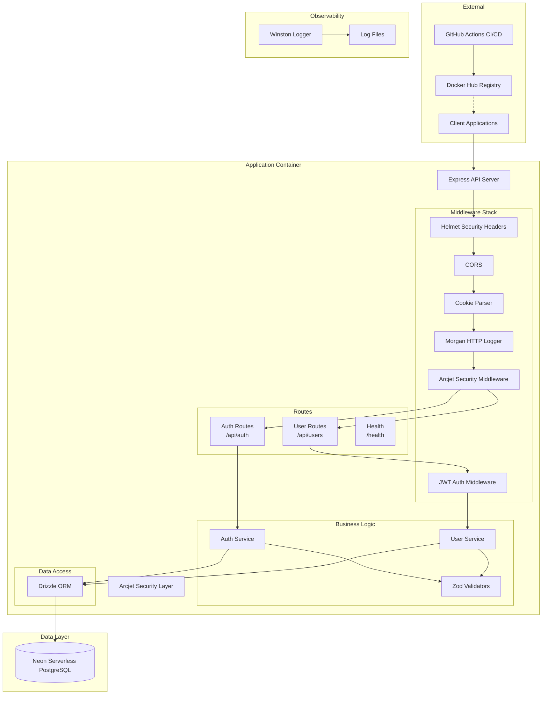
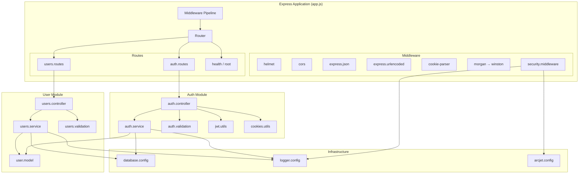
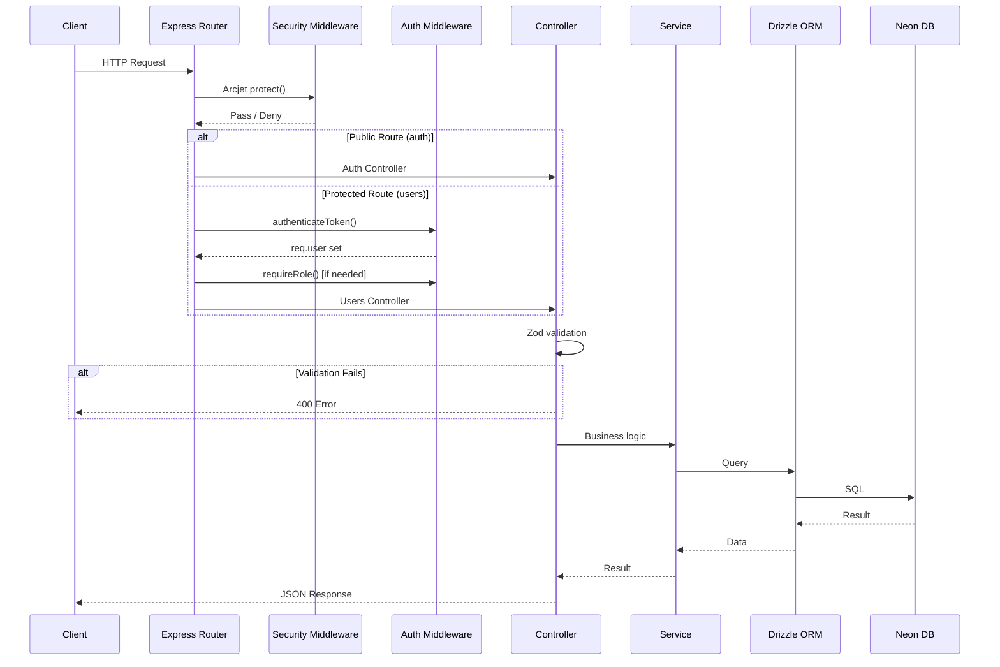
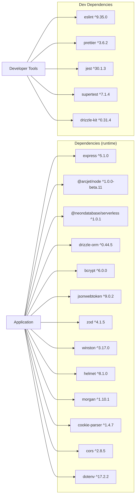
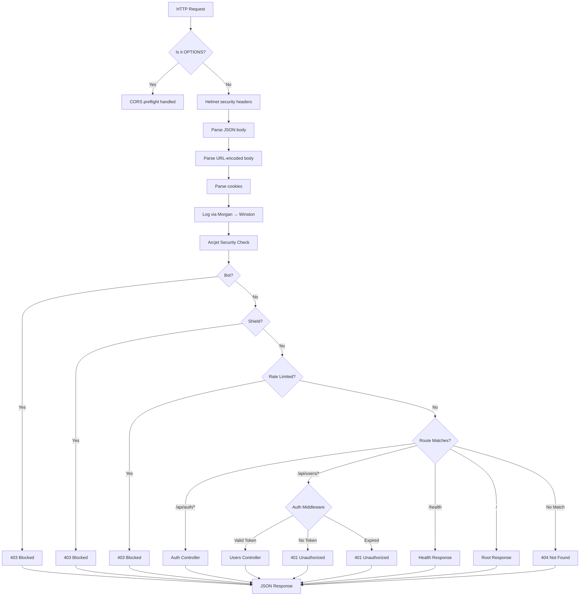
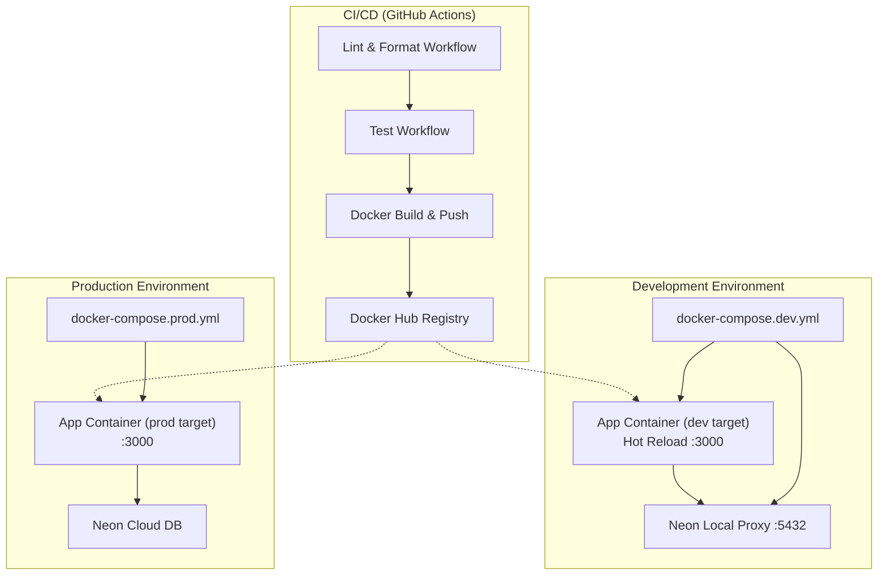

# 5. System Architecture Documentation

## High Level Architecture



**Diagram Explanation**: The system follows a layered architecture. Client requests enter through the Express server, pass through the middleware stack (Helmet → CORS → CookieParser → Morgan → Arcjet Security), then routes to appropriate controllers. Controllers use services for business logic, which use Drizzle ORM for database access. Arcjet provides external security integration. Winston logs to files independently.

## Component Diagram



**Diagram Explanation**: The application consists of two main feature modules (Auth and User), shared middleware, and infrastructure components. Each module follows the Controller → Service → Model pattern. The Auth module additionally uses JWT and Cookie utilities.

## Module Interaction Diagram



## Dependency Diagram



**Diagram Explanation**: The runtime dependency graph shows Express 5 as the core framework, with security dependencies (Arcjet, Helmet), database dependencies (Neon, Drizzle, bcrypt), and utility dependencies (JWT, Zod, Winston). Dev dependencies are isolated for development tooling only.

## Request Lifecycle Diagram



## Deployment Architecture Diagram



## Infrastructure Diagram

```mermaid
graph TB
    subgraph "Host Machine (Dev)"
        Docker[Docker Engine]
        Docker --> Dev
        Docker --> Prod
        
        subgraph "Dev Stack"
            DApp[App Container<br/>Node 18 Alpine<br/>:3000]
            DNeon[Neon Local<br/>PostgreSQL<br/>:5432]
            DVolume[Volume: .:/app<br/>Volume: /app/node_modules<br/>Volume: ./logs:/app/logs]
        end
        
        subgraph "Prod Stack"
            PApp[App Container<br/>Node 18 Alpine<br/>:3000<br/>CPU: 0.5 limit<br/>Memory: 512M limit]
            PVolume[Volume: ./logs:/app/logs]
        end
    end
    
    subgraph "External Services"
        GH[GitHub Actions]
        DH[Docker Hub]
        NC[Neon Cloud<br/>(Serverless PostgreSQL)]
        AJ[Arcjet Cloud<br/>(Security)]
    end
    
    Dev --> GH
    GH --> DH
    DH --> PApp
    PApp --> NC
    PApp --> AJ
    DApp --> AJ
    DNeon --> DApp
    PApp --> PVolume
    DApp --> DVolume
```

**Diagram Explanation**: Development uses Docker Compose with Neon Local (ephemeral PostgreSQL proxy) and hot-reload volume mounts. Production uses Docker Compose with resource limits, connects to Neon Cloud directly. GitHub Actions build multi-architecture Docker images published to Docker Hub. Arcjet provides cloud-based security services.

## Source Files Evidence

| Diagram | Supporting Files |
|---------|------------------|
| High Level Architecture | `src/app.js`, `src/server.js` |
| Component Diagram | All files in `src/` |
| Module Interaction | `src/controllers/*`, `src/services/*` |
| Dependency Diagram | `package.json` |
| Deployment Architecture | `Dockerfile`, `docker-compose.dev.yml`, `docker-compose.prod.yml` |
| Infrastructure | `Dockerfile`, `.dockerignore`, `scripts/dev.sh`, `scripts/prod.sh` |
