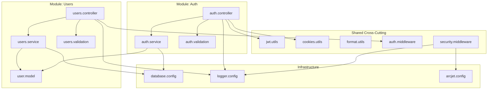

# 6. Deep Technical Architecture

## Architectural Pattern

**Pattern: Layered Architecture (with MVC-like separation)**

The system follows a variant of the Layered Architecture pattern, organized as:

```
Routes → Controllers → Services → Models (ORM)
```

This is closest to the **Model-View-Controller (MVC)** pattern adapted for API development:

| MVC Element    | Acquisitions Equivalent             | File Evidence                  |
| -------------- | ----------------------------------- | ------------------------------ |
| **Model**      | `src/models/user.model.js`          | Drizzle schema                 |
| **View**       | JSON responses (no template engine) | `res.json(...)` in controllers |
| **Controller** | `src/controllers/*.controller.js`   | Request handlers               |

**Why not Clean / Hexagonal / Onion Architecture?**

The project does not implement domain-driven design patterns (entities, value objects, repositories, use cases). Services directly call the ORM rather than going through repository abstractions. This is appropriate for the project's scope — a focused auth/user management API.

## Design Pattern Usage

### Identified Patterns

| Pattern                | Location                            | Evidence                                                             |
| ---------------------- | ----------------------------------- | -------------------------------------------------------------------- |
| **Singleton**          | `src/config/logger.js`              | Single Winston logger instance exported                              |
| **Singleton**          | `src/config/arcjet.js`              | Single Arcjet client instance                                        |
| **Singleton**          | `src/config/database.js`            | Single Drizzle DB instance                                           |
| **Strategy**           | `src/middleware/auth.middleware.js` | `requireRole` higher-order function creates role-checking middleware |
| **Middleware Chain**   | `src/app.js`                        | `app.use()` chaining (pipeline pattern)                              |
| **Factory**            | `src/utils/jwt.js`                  | `jwttoken` object with `sign`/`verify` factory methods               |
| **Controller-Service** | `controllers/` → `services/`        | Separation of concerns (request handling vs business logic)          |
| **DTO**                | `src/validations/*`                 | Zod schemas act as Data Transfer Object validators                   |
| **Module**             | ES Modules with import maps         | `package.json` `imports` field for path aliases                      |

## Modular Boundaries



**Module Boundaries**:

- **Auth Module**: Controller, Service, Validation (self-contained auth flow)
- **Users Module**: Controller, Service, Validation, Model (user CRUD operations)
- **Shared**: JWT utilities, Cookie helpers, Auth Middleware, Security Middleware (used across modules)
- **Infrastructure**: Config files (singleton connections)

## Service Boundaries

Services are thin business logic layers:

```
auth.service.js
├── hashPassword(password)      → bcrypt.hash(password, 10)
├── comparePassword(pw, hash)   → bcrypt.compare(pw, hash)
├── createUser({name, email, password, role})
│   ├── Check email uniqueness
│   ├── Hash password
│   └── INSERT via Drizzle
└── authenticateUser({email, password})
    ├── SELECT user by email
    ├── comparePassword
    └── Return user (no password)

users.service.js
├── getAllUsers()                → SELECT all (projected fields)
├── getUserById(id)             → SELECT by id
├── updateUser(id, updates)     → Check email uniqueness, UPDATE
└── deleteUser(id)              → Verify exists, DELETE
```

## Layer Separation

| Concern                   | Layer        | Files                            |
| ------------------------- | ------------ | -------------------------------- |
| HTTP transport            | Routes       | `routes/*`                       |
| Request parsing, response | Controllers  | `controllers/*`                  |
| Business rules            | Services     | `services/*`                     |
| Data access               | Models + ORM | `models/*`, `config/database.js` |
| Cross-cutting             | Middleware   | `middleware/*`                   |
| External integrations     | Config       | `config/*`                       |

**Layer Dependency Rule**: Controllers depend on Services and Validations. Services depend on Models and Config. Models are independent. No reverse dependencies.

## Dependency Management

### Import Maps (Node.js Subpath Imports)

```json
// package.json
"imports": {
  "#src/*": "./src/*",
  "#config/*": "./src/config/*",
  "#controllers/*": "./src/controllers/*",
  "#middleware/*": "./src/middleware/*",
  "#models/*": "./src/models/*",
  "#routes/*": "./src/routes/*",
  "#services/*": "./src/services/*",
  "#utils/*": "./src/utils/*",
  "#validations/*": "./src/validations/*"
}
```

This eliminates relative path hell (`../../../../`) and provides clean module references:

```js
// Instead of: import logger from '../../config/logger.js'
import logger from '#config/logger.js';
```

**Benefits**:

- Shorter, cleaner imports
- Easy refactoring (move files without changing imports)
- Explicit dependency boundaries
- Better IDE support

## Architecture Conclusions

### What Architecture Pattern Is This?

This is a **Layered Architecture with MVC conventions**, adapted for JSON API. It is NOT:

- ❌ Clean Architecture (no domain entities, no repository pattern)
- ❌ Hexagonal Architecture (no ports/adapters)
- ❌ Onion Architecture (no strict dependency inversion)
- ❌ Microservices (single process)
- ❌ Event-Driven (no events, queues, or message brokers)
- ❌ CQRS (no command/query separation)

### Is This Architecture Appropriate?

**Yes, for this scope.** The system is a focused auth/user management API. Adding Clean Architecture or Hexagonal patterns would introduce accidental complexity without proportional benefit. The current architecture provides:

| Quality             | How Achieved                                        |
| ------------------- | --------------------------------------------------- |
| **Testability**     | Controllers and services are testable via supertest |
| **Maintainability** | Clear module boundaries, import maps                |
| **Extensibility**   | New modules follow same pattern                     |
| **Simplicity**      | Minimal abstraction overhead                        |

## Source Files Evidence

| Conclusion                    | Source File                               | Evidence Lines                                                                  |
| ----------------------------- | ----------------------------------------- | ------------------------------------------------------------------------------- |
| Singleton Logger              | `src/config/logger.js:3-16`               | `const logger = winston.createLogger(...)`                                      |
| Singleton DB                  | `src/config/database.js:11-12`            | `const sql = ...; const db = drizzle(sql)`                                      |
| Strategy Pattern              | `src/middleware/auth.middleware.js:17-28` | `export const requireRole = allowedRoles => { return (req, res, next) => ... }` |
| Import Maps                   | `package.json:10-19`                      | `"imports": { "#src/*": ... }`                                                  |
| Controller-Service separation | All controller/service files              | Controllers call service methods                                                |
