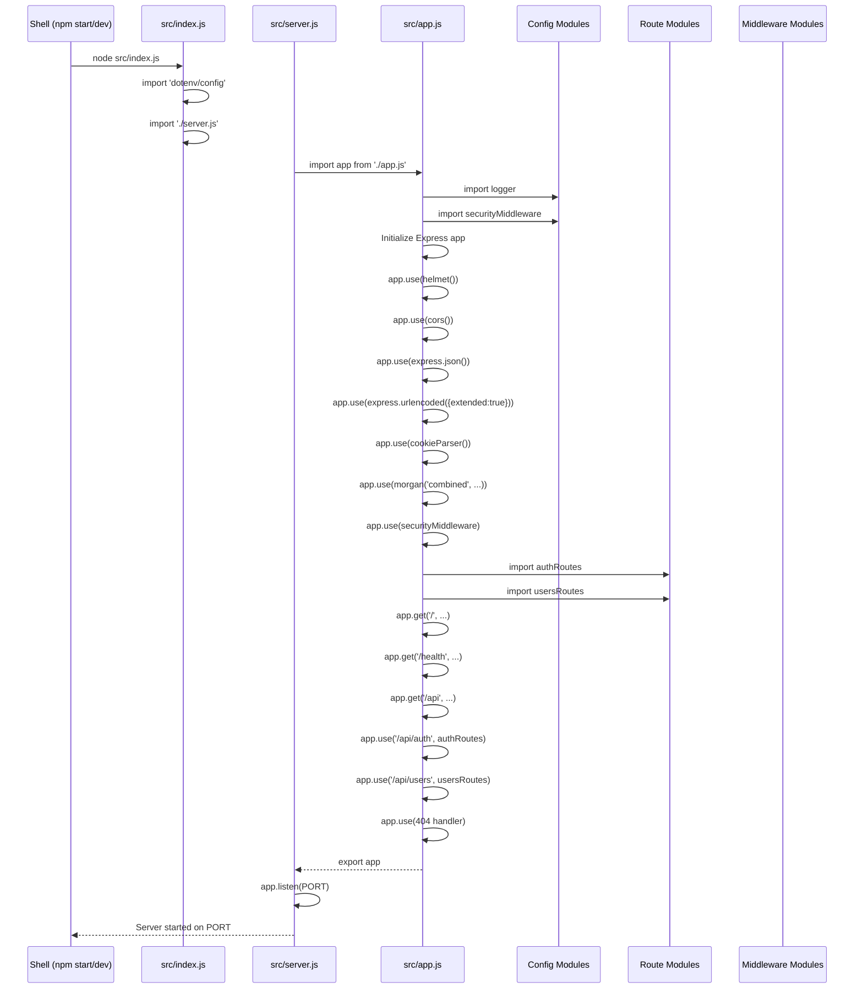
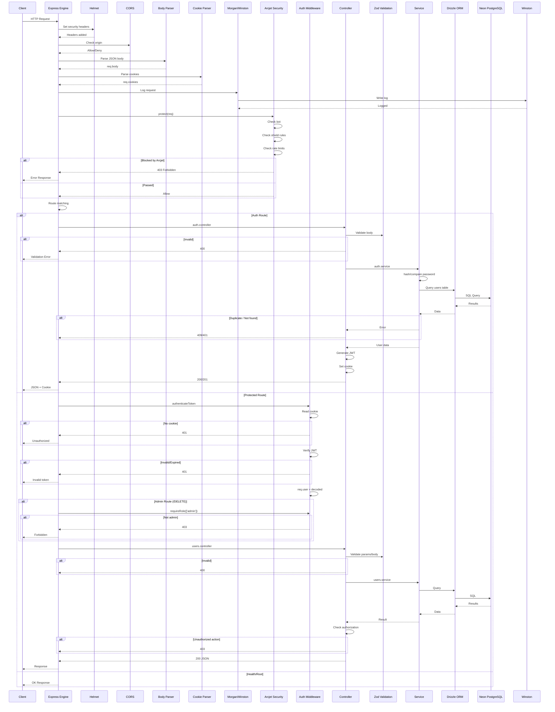
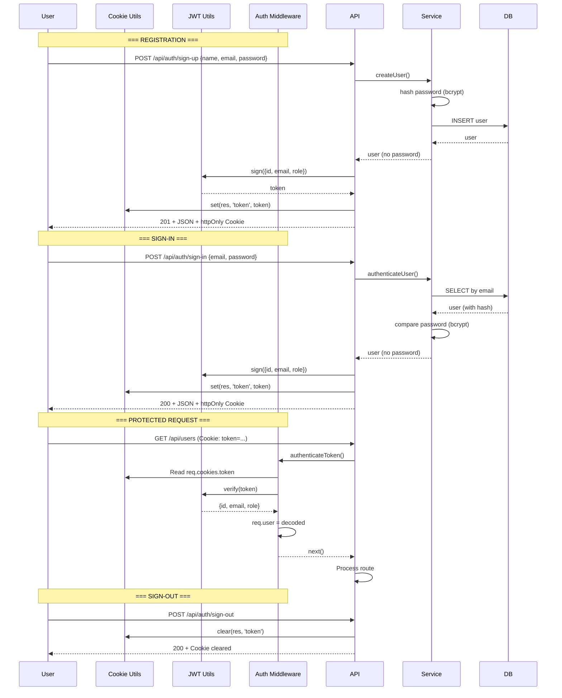
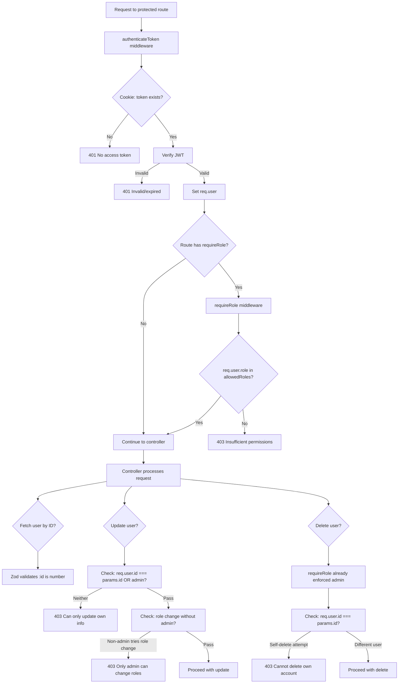

# 8. Code Flow Analysis

## Application Startup Sequence



**Startup Steps**:
1. `npm start` or `npm run dev` executes `src/index.js`
2. `dotenv/config` loads environment variables from `.env`
3. `server.js` imports `app.js` (this triggers all module imports and Express configuration)
4. All middleware is registered in order
5. Routes are imported and mounted
6. Fallback 404 handler is registered
7. Express app is exported back to `server.js`
8. `app.listen(PORT)` starts the HTTP server

## Request Lifecycle (Full Flow)



## Authentication Flow



## Authorization Flow



## Error Handling Flow

```mermaid
flowchart TB
    A[Error occurs] --> B{Error type?}
    
    B -->|Zod Validation Error| C[Controller catches]
    C --> D[Return 400 + formatted errors]
    
    B -->|Business Logic Error| E[Controller catches]
    E --> F[Check error.message]
    F -->|'User with this email...'| G[Return 409]
    F -->|'User not found'| H[Return 404]
    F -->|'Invalid password'| I[Return 401]
    F -->|'Email already exists'| J[Return 409]
    F -->|Other| K[Call next(error)]
    
    B -->|JWT Error| L[Auth middleware catches]
    L -->|'Failed to authenticate'| M[Return 401]
    L -->|Other| N[Return 500]
    
    B -->|Unexpected Error| K
    
    K --> O[Express default error handler]
    O --> P[500 Internal Server Error]
    
    %% Winston logging at every step
    A -.-> Q[Winston: logger.error()]
```

## Logging Flow

```mermaid
flowchart LR
    subgraph "Log Sources"
        A[Application Code]
        B[Morgan HTTP Logger]
    end
    
    subgraph "Winston Logger"
        C[Logger Instance]
        D[Format: JSON + Timestamp + Errors Stack + Service Name]
    end
    
    subgraph "Transports"
        E[File: logs/combined.log<br/>All levels]
        F[File: logs/error.lg<br/>Error level only]
        G[Console<br/>(Non-production only)<br/>Colorized + Simple format]
    end
    
    A --> C
    B --> C
    C --> D
    D --> E
    D --> F
    D --> G
```

**Log Levels Used** (from source analysis of `logs/combined.log` and `logs/error.lg`):
- `logger.info()` — User registrations, sign-ins, sign-outs, successful operations
- `logger.error()` — Failed operations, exceptions, auth failures
- `logger.warn()` — Rate limit exceeded, bot blocked, authorization denied

## Background Jobs Flow

**Not enough evidence found in repository.** The project does not implement any background jobs, task queues, or scheduled operations. All processing is synchronous within the request lifecycle.

## Event Processing Flow

**Not enough evidence found in repository.** The project does not implement any event-driven patterns. There are no:
- Event emitters
- Message queues
- Webhook deliveries
- Event listeners/handlers

## Source Files Evidence

| Flow | Key Files |
|------|-----------|
| Startup | `src/index.js:1-2`, `src/server.js:1-6`, `src/app.js:1-52` |
| Request Lifecycle | `src/app.js` (middleware order), `src/middleware/security.middleware.js` |
| Authentication | `src/middleware/auth.middleware.js`, `src/utils/jwt.js:1-18`, `src/utils/cookies.js` |
| Authorization | `src/middleware/auth.middleware.js:17-28`, `src/controllers/users.controller.js:32-64` |
| Error Handling | `src/controllers/auth.controller.js`, `src/controllers/users.controller.js` (all try-catch blocks) |
| Logging | `src/config/logger.js`, `src/app.js:21-24` (morgan integration) |
