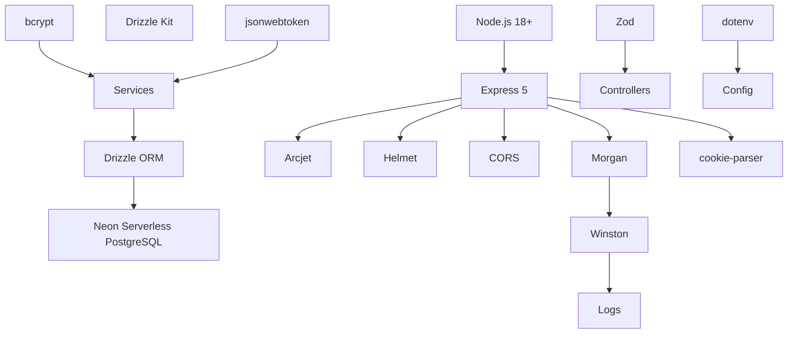

# 7. Technology Stack Analysis

## Runtime & Language

| Technology      | Purpose            | Why Used                                | Benefits                                                       | Alternatives         | Tradeoffs                                                            |
| --------------- | ------------------ | --------------------------------------- | -------------------------------------------------------------- | -------------------- | -------------------------------------------------------------------- |
| **Node.js 18+** | JavaScript runtime | Industry standard for backend APIs      | Event-driven non-blocking I/O, massive ecosystem, npm registry | Deno, Bun            | Single-threaded for CPU-intensive tasks, callback complexity         |
| **ES Modules**  | Module system      | Modern JS standard, better tree-shaking | `import`/`export` syntax, static analysis, top-level await     | CommonJS (`require`) | Requires `"type": "module"` in package.json, some packages still CJS |

## Framework

| Technology    | Purpose        | Why Used                                   | Benefits                                                 | Alternatives               | Tradeoffs                                                                                      |
| ------------- | -------------- | ------------------------------------------ | -------------------------------------------------------- | -------------------------- | ---------------------------------------------------------------------------------------------- |
| **Express 5** | HTTP framework | Most popular Node.js framework, stable API | Mature ecosystem, massive middleware library, simple API | Fastify, Hono, Koa, NestJS | Opinionated callback patterns, less performant than Fastify, error handling improvements in v5 |

## Database & ORM

| Technology                     | Purpose                   | Why Used                             | Benefits                                                                    | Alternatives                                | Tradeoffs                                         |
| ------------------------------ | ------------------------- | ------------------------------------ | --------------------------------------------------------------------------- | ------------------------------------------- | ------------------------------------------------- |
| **Neon Serverless PostgreSQL** | Database                  | Serverless Postgres with branching   | Database branching for dev/test, serverless scaling, Postgres compatibility | Supabase, AWS RDS, PlanetScale, CockroachDB | Cold starts, network latency, vendor lock-in risk |
| **Drizzle ORM**                | Object-Relational Mapping | Lightweight, type-safe, SQL-like API | No code generation, thin abstraction, good Drizzle Kit tooling              | Prisma, TypeORM, Knex, Sequelize            | Smaller community than Prisma, less mature        |
| **Drizzle Kit**                | Migration tool            | Drizzle's native migration CLI       | Auto-generate SQL from schema, migration management                         | Prisma Migrate, node-pg-migrate             | Tied to Drizzle ORM                               |

## Authentication & Security

| Technology             | Purpose                       | Why Used                                                | Benefits                                                                     | Alternatives                                      | Tradeoffs                                                                                             |
| ---------------------- | ----------------------------- | ------------------------------------------------------- | ---------------------------------------------------------------------------- | ------------------------------------------------- | ----------------------------------------------------------------------------------------------------- |
| **Arcijet**            | Security platform             | All-in-one security (rate limit, bot detection, shield) | Single integration for multiple security concerns, cloud-managed rules       | express-rate-limit, Cloudflare, custom middleware | Beta software (v1.0.0-beta.11), external dependency, cost at scale                                    |
| **Helmet**             | Security headers              | Set secure HTTP headers                                 | Easy protection against common web vulnerabilities (XSS, clickjacking, etc.) | Custom headers middleware                         | Adds minimal overhead, can break some functionality (e.g., CSP blocking inline scripts)               |
| **CORS**               | Cross-Origin Resource Sharing | Enable controlled cross-origin requests                 | Configurable origin policies                                                 | Manual headers                                    | Default permissive config (`cors()` without options)                                                  |
| **bcrypt**             | Password hashing              | Industry standard for password storage                  | Adaptive cost factor, built-in salt, slow by design                          | argon2, scrypt, pbkdf2                            | CPU-intensive, 10 rounds may be slow for high-traffic signup                                          |
| **jsonwebtoken (JWT)** | Token-based auth              | Stateless authentication                                | No server-side session storage, compact token format, widely supported       | session cookies + Redis, PASETO                   | Cannot revoke tokens server-side, token size grows with claims, security depends on secret management |
| **Zod**                | Schema validation             | Runtime type validation + parsing                       | TypeScript-like schema API, composable, no code generation                   | Joi, Yup, AJV                                     | Slightly different API than Joi, Zod v4 may have breaking changes from v3                             |

## Logging & Observability

| Technology  | Purpose              | Why Used                            | Benefits                                               | Alternatives             | Tradeoffs                                                |
| ----------- | -------------------- | ----------------------------------- | ------------------------------------------------------ | ------------------------ | -------------------------------------------------------- |
| **Winston** | Logging              | Mature, configurable Node.js logger | Multiple transports, log levels, formatting, streaming | Pino, Bunyan, log4js     | Pino is faster (benchmarked), Winston adds more overhead |
| **Morgan**  | HTTP request logging | Standard Express HTTP logger        | Pre-defined formats, stream integration with Winston   | Custom logger middleware | Additional middleware in chain, limited customization    |

## Development & Tooling

| Technology    | Purpose         | Why Used                          | Benefits                                                            | Alternatives                    | Tradeoffs                                               |
| ------------- | --------------- | --------------------------------- | ------------------------------------------------------------------- | ------------------------------- | ------------------------------------------------------- |
| **ESLint**    | Linting         | Static code analysis              | Catch errors early, enforce code style                              | JSHint, JSLint                  | Flat config (v9) differs from .eslintrc, learning curve |
| **Prettier**  | Code formatting | Opinionated code formatter        | Consistent formatting, editor integration, no configuration debates | ESLint formatting rules, dprint | Less configurable, formatting-only (no linting)         |
| **Jest**      | Testing         | Feature-rich test framework       | Zero-config, built-in coverage, mocking, snapshot testing           | Vitest, Mocha, Ava              | Node experimental VM modules flag required for ESM      |
| **Supertest** | HTTP testing    | Test Express apps without network | In-memory HTTP assertions, chaining API                             | node-fetch, axios in tests      | Tight coupling to Express/HTTP                          |

## Container & Infrastructure

| Technology                    | Purpose                       | Why Used                                   | Benefits                                                | Alternatives                          | Tradeoffs                                     |
| ----------------------------- | ----------------------------- | ------------------------------------------ | ------------------------------------------------------- | ------------------------------------- | --------------------------------------------- |
| **Docker**                    | Containerization              | Consistent environments across dev/prod/CI | Reproducible builds, isolation, CI/CD integration       | Podman, containerd                    | Build time, image size, learning curve        |
| **Docker Compose**            | Multi-container orchestration | Define and run multi-container Docker apps | Simple YAML config, dev/prod parity, network management | Kubernetes (overkill for this scale)  | Not for production orchestration, single host |
| **Docker Multi-stage Builds** | Optimized images              | Separated dev and prod builds              | Smaller production images, no dev dependencies in prod  | Single-stage build with .dockerignore | Complex Dockerfile, longer build times        |

## CI/CD

| Technology         | Purpose           | Why Used                          | Benefits                                                  | Alternatives                  | Tradeoffs                                       |
| ------------------ | ----------------- | --------------------------------- | --------------------------------------------------------- | ----------------------------- | ----------------------------------------------- |
| **GitHub Actions** | CI/CD pipeline    | Integrated with GitHub repository | Free for public repos, marketplace actions, matrix builds | GitLab CI, Jenkins, CircleCI  | Limited to GitHub, Windows/macOS runners slower |
| **Docker Buildx**  | Multi-arch builds | Build for amd64 + arm64           | Cross-platform images (Apple Silicon, ARM servers)        | QEMU emulation, native builds | Slower builds, more complex caching             |

## Summary Dependency Graph

## Source Files Evidence

| Technology     | Evidence                                                          |
| -------------- | ----------------------------------------------------------------- |
| Express 5      | `package.json`: `"express": "^5.1.0"`, `src/app.js`               |
| Neon/Drizzle   | `src/config/database.js`, `package.json`                          |
| Arcjet         | `src/config/arcjet.js`, `package.json`                            |
| Helmet         | `src/app.js:7`, `package.json`                                    |
| JWT            | `src/utils/jwt.js`, `package.json`                                |
| Zod            | `src/validations/*`, `package.json`                               |
| Winston        | `src/config/logger.js`, `package.json`                            |
| Morgan         | `src/app.js:8,21-24`, `package.json`                              |
| Docker         | `Dockerfile`, `docker-compose.dev.yml`, `docker-compose.prod.yml` |
| GitHub Actions | `.github/workflows/*`                                             |
