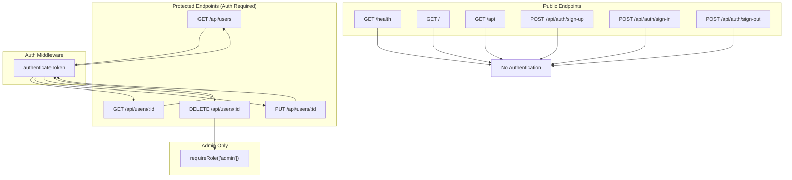

# 9. API Documentation

## API Overview

| Attribute          | Value                                      |
| ------------------ | ------------------------------------------ |
| **Base URL**       | `http://localhost:3000` (default)          |
| **Protocol**       | HTTP (HTTPS in production)                 |
| **Format**         | JSON                                       |
| **Authentication** | JWT via httpOnly Cookie (`token`)          |
| **Security**       | Helmet headers, CORS, Arcjet rate limiting |
| **Validation**     | Zod                                        |

## API Endpoints

### 1. Health Check

```
GET /health
```

**Purpose**: Application liveness probe used by Docker health checks and monitoring.

**Authentication**: None

**Rate Limit**: Subject to guest rate limit (5 req/min)

**Response**: `200 OK`

```json
{
  "status": "OK",
  "timestamp": "2026-06-21T12:00:00.000Z",
  "uptime": 123.456
}
```

| Field       | Type              | Description               |
| ----------- | ----------------- | ------------------------- |
| `status`    | string            | Always "OK" when healthy  |
| `timestamp` | string (ISO 8601) | Current server time       |
| `uptime`    | number            | Process uptime in seconds |

**Errors**: None (always returns 200 if server is running)

---

### 2. Root

```
GET /
```

**Purpose**: Welcome message / API root.

**Authentication**: None

**Response**: `200 OK`

```
Hello from Acquisitions!
```

**Errors**: None

---

### 3. API Status

```
GET /api
```

**Purpose**: API status indicator.

**Authentication**: None

**Response**: `200 OK`

```json
{
  "message": "Acquisitions API is running!"
}
```

---

### 4. User Registration

```
POST /api/auth/sign-up
```

**Purpose**: Create a new user account. Sets JWT cookie on success.

**Authentication**: None (self-service registration)

**Request Body**:

```json
{
  "name": "John Doe",
  "email": "john@example.com",
  "password": "securePassword123",
  "role": "user"
}
```

| Field      | Type           | Required             | Validation                                       |
| ---------- | -------------- | -------------------- | ------------------------------------------------ |
| `name`     | string         | Yes                  | 2-255 characters, trimmed                        |
| `email`    | string (email) | Yes                  | Valid email format, max 255, lowercased, trimmed |
| `password` | string         | Yes                  | 6-128 characters                                 |
| `role`     | string         | No (default: "user") | Must be "user" or "admin"                        |

**Response**: `201 Created`

```json
{
  "message": "User registered",
  "user": {
    "id": 1,
    "name": "John Doe",
    "email": "john@example.com",
    "role": "user"
  }
}
```

**Cookies Set**:
| Cookie | Value | Attributes |
|--------|-------|------------|
| `token` | JWT string | httpOnly, secure (prod), sameSite=strict, maxAge=15min |

**Errors**:

| Status | Condition             |
| ------ | --------------------- |
| `400`  | Validation failed     |
| `409`  | Email already exists  |
| `500`  | Internal server error |

---

### 5. User Sign-In

```
POST /api/auth/sign-in
```

**Purpose**: Authenticate existing user. Sets JWT cookie on success.

**Authentication**: None (self-service sign-in)

**Request Body**:

```json
{
  "email": "john@example.com",
  "password": "securePassword123"
}
```

| Field      | Type           | Required | Validation                       |
| ---------- | -------------- | -------- | -------------------------------- |
| `email`    | string (email) | Yes      | Valid email, lowercased, trimmed |
| `password` | string         | Yes      | Min 1 character                  |

**Response**: `200 OK`

```json
{
  "message": "User signed in successfully",
  "user": {
    "id": 1,
    "name": "John Doe",
    "email": "john@example.com",
    "role": "user"
  }
}
```

**Cookies Set**: Same as registration (JWT token)

**Errors**:

| Status | Condition                                                          |
| ------ | ------------------------------------------------------------------ |
| `400`  | Validation failed                                                  |
| `401`  | Invalid credentials (ambiguous — same for wrong email or password) |

---

### 6. User Sign-Out

```
POST /api/auth/sign-out
```

**Purpose**: Clear authentication cookie, end session.

**Authentication**: None required

**Response**: `200 OK`

```json
{
  "message": "User signed out successfully"
}
```

**Cookies Cleared**: `token` cookie deleted

---

### 7. List All Users

```
GET /api/users
```

**Purpose**: Retrieve all registered users.

**Authentication**: Required (valid JWT cookie)

**Authorization**: Any authenticated user

**Response**: `200 OK`

```json
{
  "message": "Successfully retrieved users",
  "users": [
    {
      "id": 1,
      "email": "john@example.com",
      "name": "John Doe",
      "role": "user",
      "created_at": "2026-06-21T12:00:00.000Z",
      "updated_at": "2026-06-21T12:00:00.000Z"
    }
  ],
  "count": 1
}
```

**Notes**: Password hash is never returned. Returns all users (no pagination).

**Errors**:

| Status | Condition                 |
| ------ | ------------------------- |
| `401`  | No token or invalid token |
| `500`  | Internal server error     |

---

### 8. Get User by ID

```
GET /api/users/:id
```

**Purpose**: Retrieve a specific user by ID.

**Authentication**: Required

**Parameters**:
| Param | Type | Validation |
|-------|------|------------|
| `id` | string (path) | Must be a positive numeric string |

**Response**: `200 OK`

```json
{
  "message": "User retrieved successfully",
  "user": {
    "id": 1,
    "email": "john@example.com",
    "name": "John Doe",
    "role": "user",
    "created_at": "2026-06-21T12:00:00.000Z",
    "updated_at": "2026-06-21T12:00:00.000Z"
  }
}
```

**Errors**:

| Status | Condition                 |
| ------ | ------------------------- |
| `400`  | Invalid ID format         |
| `401`  | No token or invalid token |
| `404`  | User not found            |

---

### 9. Update User

```
PUT /api/users/:id
```

**Purpose**: Update user profile fields. Users can update their own profile; admins can update any profile.

**Authentication**: Required

**Authorization**:

- Users can update their own profile only
- Admins can update any profile
- Non-admin users cannot change roles
- Self-role field is stripped for non-admins

**Request Body** (all fields optional, at least one required):

```json
{
  "name": "Jane Doe",
  "email": "jane@example.com"
}
```

| Field   | Type                | Required | Validation                                |
| ------- | ------------------- | -------- | ----------------------------------------- |
| `name`  | string              | No       | 2-255 chars, trimmed                      |
| `email` | string (email)      | No       | Valid email, max 255, lowercased, trimmed |
| `role`  | string (admin only) | No       | Must be "user" or "admin"                 |

**Response**: `200 OK`

```json
{
  "message": "User updated successfully",
  "user": {
    "id": 1,
    "email": "jane@example.com",
    "name": "Jane Doe",
    "role": "user",
    "created_at": "2026-06-21T12:00:00.000Z",
    "updated_at": "2026-06-21T12:02:00.000Z"
  }
}
```

**Errors**:

| Status | Condition                                            |
| ------ | ---------------------------------------------------- |
| `400`  | Validation failed                                    |
| `401`  | No token or invalid token                            |
| `403`  | Not authorized (updating another user without admin) |
| `404`  | User not found                                       |
| `409`  | Email already exists                                 |

---

### 10. Delete User

```
DELETE /api/users/:id
```

**Purpose**: Delete a user account. Admin-only operation.

**Authentication**: Required

**Authorization**: Admin role only

**Restrictions**: Users cannot delete their own account

**Response**: `200 OK`

```json
{
  "message": "User deleted successfully",
  "user": {
    "id": 1,
    "email": "john@example.com",
    "name": "John Doe",
    "role": "user"
  }
}
```

**Errors**:

| Status | Condition                            |
| ------ | ------------------------------------ |
| `400`  | Invalid ID format                    |
| `401`  | No token or invalid token            |
| `403`  | Not admin, or attempting self-delete |
| `404`  | User not found                       |

---

## API Flow Diagram



## API Error Response Format

All error responses follow this structure:

```json
{
  "error": "Error type",
  "message": "Human-readable message",
  "details": "Optional validation details"
}
```

### Validation Error Details

```json
{
  "error": "Validation failed",
  "details": "Name is too short, Email is invalid"
}
```

## Source Files Evidence

| API         | Route File                   | Controller                            | Validation                            |
| ----------- | ---------------------------- | ------------------------------------- | ------------------------------------- |
| Health/Root | `src/app.js`                 | Inline                                | None                                  |
| Auth        | `src/routes/auth.routes.js`  | `src/controllers/auth.controller.js`  | `src/validations/auth.validation.js`  |
| Users       | `src/routes/users.routes.js` | `src/controllers/users.controller.js` | `src/validations/users.validation.js` |
