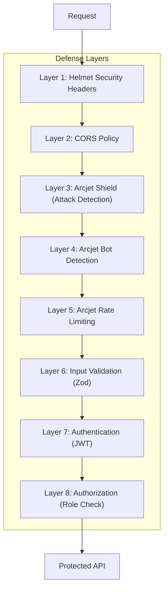
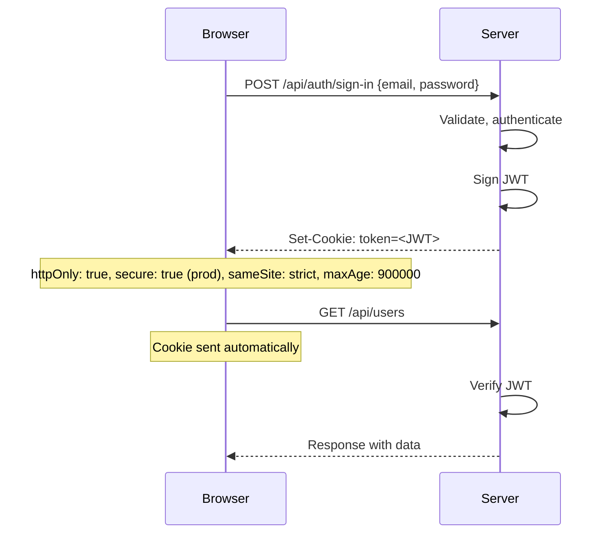
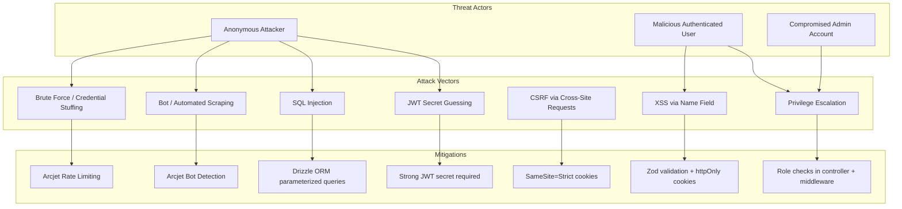

# 13. Security Documentation

## Security Architecture Overview

## Authentication

### Mechanism: JWT via httpOnly Cookie

| Property     | Implementation                                  | File                     |
| ------------ | ----------------------------------------------- | ------------------------ |
| Token type   | JSON Web Token (JWT)                            | `src/utils/jwt.js`       |
| Storage      | httpOnly cookie (not accessible via JavaScript) | `src/utils/cookies.js`   |
| Secure flag  | Enabled in production                           | `src/utils/cookies.js:4` |
| SameSite     | Strict                                          | `src/utils/cookies.js:5` |
| MaxAge       | 15 minutes                                      | `src/utils/cookies.js:6` |
| Token expiry | 1 day                                           | `src/utils/jwt.js:5`     |
| Algorithm    | HS256 (default for jsonwebtoken)                | `src/utils/jwt.js`       |
| Secret       | JWT_SECRET env var (with fallback)              | `src/utils/jwt.js:4`     |

### Cookie Security Flow

**Strengths**:

- httpOnly prevents XSS-based token theft
- SameSite=Strict prevents CSRF
- Secure flag in production prevents MITM

**Weaknesses**:

- Secret fallback in code (hardcoded default)
- No token rotation/refresh mechanism
- No token revocation capability
- Same maxAge (15min) for all tokens regardless of role

## Authorization

### Role-Based Access Control

| Check                   | Location                                    | Enforcement                     |
| ----------------------- | ------------------------------------------- | ------------------------------- |
| Valid JWT required      | `src/middleware/auth.middleware.js:6-7`     | 401 if missing/expired/invalid  |
| Role check (admin)      | `src/middleware/auth.middleware.js:17-28`   | 403 if role not in allowed list |
| Self-only update        | `src/controllers/users.controller.js:44-45` | 403 if non-admin updates others |
| Admin-only role changes | `src/controllers/users.controller.js:47-48` | 403 if non-admin sends role     |
| Self-delete blocked     | `src/controllers/users.controller.js:74`    | 403 if user deletes own account |

### Authorization Matrix

| Action         | Guest | User (self) | User (other) | Admin          |
| -------------- | ----- | ----------- | ------------ | -------------- |
| Register       | Yes   | -           | -            | -              |
| Sign In        | Yes   | -           | -            | -              |
| List Users     | No    | Yes         | Yes          | Yes            |
| Get User by ID | No    | Yes         | Yes          | Yes            |
| Update User    | No    | Yes         | No           | Yes            |
| Change Role    | No    | No          | No           | Yes            |
| Delete User    | No    | No          | No           | Yes (not self) |

## Secrets Management

| Secret       | Location                      | Risk Level | Issue                                                             |
| ------------ | ----------------------------- | ---------- | ----------------------------------------------------------------- |
| DATABASE_URL | `.env` (committed)            | CRITICAL   | Production database credentials in version control                |
| ARCJET_KEY   | `.env` (committed)            | HIGH       | Arcjet API key in version control                                 |
| JWT_SECRET   | `src/utils/jwt.js` (fallback) | HIGH       | Hardcoded fallback: 'your-secret-key-please-change-in-production' |
| JWT_SECRET   | `.env` (expected)             | MEDIUM     | Must be set in production env                                     |
| NODE_ENV     | `.env`                        | LOW        | Controls secure cookie behavior                                   |

## Encryption

| Data             | Encryption     | Algorithm          | Notes                                          |
| ---------------- | -------------- | ------------------ | ---------------------------------------------- |
| Passwords        | bcrypt hash    | bcrypt (10 rounds) | One-way hash, salted                           |
| JWT tokens       | HMAC-SHA256    | HS256              | Symmetric signing                              |
| Transport (dev)  | None (HTTP)    | -                  | Localhost only                                 |
| Transport (prod) | TLS (expected) | -                  | Not configured in code, requires reverse proxy |

## Security Risks & Recommendations

### Critical Risks

1. **Credentials in Version Control** (`.env` committed with real secrets)
   - Impact: Anyone with repo access has production database credentials
   - Fix: Remove `.env` from git tracking, rotate all exposed credentials, use environment-specific `.env.*` files (already in `.gitignore`)
   - Evidence: `.env` file with real `DATABASE_URL` and `ARCJET_KEY`

2. **Hardcoded JWT Secret Fallback**
   - Impact: If `JWT_SECRET` not set, uses predictable secret
   - Fix: Remove fallback, crash at startup if JWT_SECRET is not set
   - Evidence: `src/utils/jwt.js:4` — `const JWT_SECRET = process.env.JWT_SECRET || 'your-secret-key-please-change-in-production'`

### High Risks

3. **No Rate Limiting on Auth Endpoints** (Arcjet rate limit is global)
   - Impact: Brute force attacks on sign-in possible (5 req/2s global + 5 req/min guest)
   - Recommendation: Add stricter auth-specific rate limits, account lockout after N attempts

4. **No Password Complexity Requirements**
   - Impact: 6-character minimum allows weak passwords
   - Recommendation: Add uppercase, lowercase, digit, symbol requirements

5. **CORS Default Configuration**
   - Impact: `cors()` without options allows all origins
   - Evidence: `src/app.js:8` — `app.use(cors())`
   - Fix: Restrict to specific origins in production

### Medium Risks

6. **No Input Sanitization for XSS**
   - Impact: Names could contain malicious scripts (though stored in DB, not rendered in HTML directly)
   - Recommendation: Add Zod `.transform()` or sanitize inputs

7. **Password Not Returned (Good) but User Enumeration Possible**
   - Impact: Registration returns 409 vs sign-in returns 401 — different responses allow email enumeration
   - Recommendation: Consider generic responses for auth endpoints

8. **No HTTPS Configuration**
   - Impact: All traffic is plain HTTP in development
   - Recommendation: Development should use HTTPS as well

## Threat Model

## OWASP Top 10 Mapping

| OWASP Category                 | Status            | Evidence                                          |
| ------------------------------ | ----------------- | ------------------------------------------------- |
| A01: Broken Access Control     | ⚠️ Partial        | Role-based checks, but user can register as admin |
| A02: Cryptographic Failures    | ⚠️ Partial        | bcrypt for passwords, but JWT secret fallback     |
| A03: Injection                 | ✅ Mitigated      | Parameterized queries via Drizzle ORM             |
| A04: Insecure Design           | ⚠️ Partial        | Rate limiting present, but no account lockout     |
| A05: Security Misconfiguration | ⚠️ Partial        | Helmet active, CORS permissive                    |
| A06: Vulnerable Components     | ⚠️ Requires audit | Dependencies should be scanned (npm audit)        |
| A07: ID & Auth Failures        | ⚠️ Partial        | JWT cookies secure, but no MFA, no session revoke |
| A08: Data Integrity Failures   | ⚠️ Partial        | JWT signed but no nonce/audience claims           |
| A09: Logging & Monitoring      | ✅ Present        | Winston logging, error tracking                   |
| A10: SSRF                      | ❌ Not assessed   | No outbound URL fetching in app                   |

## Source Files Evidence

| Security Feature     | File                                    | Line(s) |
| -------------------- | --------------------------------------- | ------- |
| Helmet middleware    | `src/app.js`                            | 7       |
| CORS (permissive)    | `src/app.js`                            | 8       |
| Cookie parser        | `src/app.js`                            | 10      |
| Arcjet security      | `src/middleware/security.middleware.js` | All     |
| Arcjet configuration | `src/config/arcjet.js`                  | All     |
| JWT utilities        | `src/utils/jwt.js`                      | All     |
| Cookie utilities     | `src/utils/cookies.js`                  | All     |
| Auth middleware      | `src/middleware/auth.middleware.js`     | All     |
| Role authorization   | `src/middleware/auth.middleware.js`     | 17-28   |
| Password hashing     | `src/services/auth.service.js`          | 6-14    |
| Zod validation       | `src/validations/*.js`                  | All     |
| Secrets in .env      | `.env`                                  | All     |
| JWT secret fallback  | `src/utils/jwt.js`                      | 4       |
