# 14. Performance Documentation

## Performance Analysis

### Bottlenecks

| Area                       | Bottleneck                             | Evidence                            | Impact                                   |
| -------------------------- | -------------------------------------- | ----------------------------------- | ---------------------------------------- |
| **Password Hashing**       | bcrypt with 10 salt rounds             | `src/services/auth.service.js:7`    | ~200-300ms per hash on signup/signin     |
| **No Pagination**          | `SELECT * FROM users` returns all rows | `src/services/users.service.js:7-9` | Degrades linearly with user count        |
| **No Connection Pooling**  | Single `neon()` connection             | `src/config/database.js:11`         | Connection overhead on every query       |
| **Synchronous Middleware** | Express middleware runs sequentially   | `src/app.js` middleware chain       | Blocking operations delay other requests |
| **Winston File Logging**   | Synchronous writes to file             | `src/config/logger.js:12-13`        | I/O blocking on every log write          |

### Hot Paths

```mermaid
flowchart TB
    subgraph "Hot Path 1: Sign-In (Most Frequent)"
        SI1["Parse request body"]
        SI2["Validate with Zod"]
        SI3["Query DB by email (indexed)"]
        SI4["bcrypt.compare (300ms)"]
        SI5["Sign JWT"]
        SI6["Set cookie"]
        SI7["Log + Respond"]

        SI1 --> SI2 --> SI3 --> SI4 --> SI5 --> SI6 --> SI7
    end

    subgraph "Hot Path 2: Authenticated Request (Second Most Frequent)"
        AR1["Parse cookies"]
        AR2["Verify JWT (fast)"]
        AR3["Arcjet rate limit check"]
        AR4["DB query"]
        AR5["Log + Respond"]

        AR1 --> AR2 --> AR3 --> AR4 --> AR5
    end
```

### Expensive Operations

| Operation               | Cost                  | Frequency              | Optimization                                          |
| ----------------------- | --------------------- | ---------------------- | ----------------------------------------------------- |
| bcrypt hash (signup)    | ~300ms CPU            | Low (per registration) | Acceptable; cannot optimize without reducing security |
| bcrypt compare (signin) | ~300ms CPU            | Medium (per login)     | Acceptable; security requirement offsets cost         |
| List all users          | O(n) query + transfer | Low (admin only)       | Add pagination (LIMIT/OFFSET)                         |
| Arcjet protect() call   | Network latency       | Every request          | Acceptable; security middleware overhead              |

### Scaling Limitations

| Dimension                | Current State                 | Limit                       | Recommendation                              |
| ------------------------ | ----------------------------- | --------------------------- | ------------------------------------------- |
| **Concurrent Users**     | Single Node.js process        | ~10K concurrent             | Add cluster mode, load balancer             |
| **Database Connections** | Single connection             | Neon free tier limits       | Add connection pooling (pg-pool, PgBouncer) |
| **Request Throughput**   | Limited by Node.js event loop | ~1K-2K req/s on single core | Horizontal scaling with container replicas  |
| **Data Volume**          | No pagination                 | ~10K rows manageable        | Add pagination by 10K users                 |
| **Cold Start**           | Neon serverless cold start    | 1-5 seconds                 | Keep warm with scheduled pings              |

### Current Behavior

- Signup: ~400ms (Zod validation + bcrypt hash + DB insert + JWT sign + log)
- Signin: ~400ms (Zod validation + DB query + bcrypt compare + JWT sign + log)
- User list: ~50ms for small datasets, scales O(n)
- Health check: ~5ms
- Rate limited request: ~10ms (blocked early by Arcjet)

### Risks

1. **No caching**: Every request hits the database. No Redis or in-memory cache.
2. **Sync bcrypt on signin**: Blocks event loop during password comparison. Consider `bcrypt.hash` with worker threads or move to async.
3. **Winston synchronous writes**: In production, the event loop may be blocked by log writes.
4. **No connection pool**: Each query establishes a new connection in some configurations.

### Optimizations

| Priority | Optimization                     | Effort  | Impact                               | ETA          |
| -------- | -------------------------------- | ------- | ------------------------------------ | ------------ |
| **P1**   | Add pagination to GET /api/users | 1 hour  | High (prevents O(n) degradation)     | Now          |
| **P2**   | Add Redis caching for user data  | 1 day   | High (reduces DB load)               | Near-term    |
| **P3**   | Use worker threads for bcrypt    | 2 days  | Medium (non-blocking hashing)        | Medium-term  |
| **P4**   | Add connection pooling           | 2 hours | Medium (reduces connection overhead) | Now          |
| **P5**   | Implement cluster mode           | 1 day   | High (multi-core utilization)        | Medium-term  |
| **P6**   | Replace Winston with Pino        | 4 hours | Low (faster logging)                 | Low priority |

## Source Files Evidence

| Performance Factor    | File                            | Line(s) |
| --------------------- | ------------------------------- | ------- |
| bcrypt 10 rounds      | `src/services/auth.service.js`  | 7       |
| No pagination         | `src/services/users.service.js` | 7-9     |
| Single connection     | `src/config/database.js`        | 11      |
| Winston async concern | `src/config/logger.js`          | 12-13   |
| Middleware chain      | `src/app.js`                    | 7-26    |
