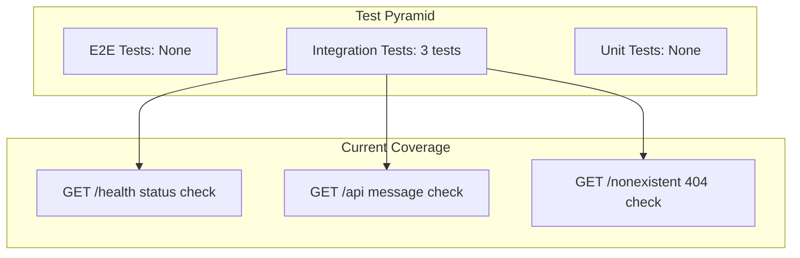

# 15. Testing Documentation

## Testing Strategy



## Current Test Suite

**File**: `tests/app.test.js`

```javascript
import request from 'supertest';
import app from '#src/app.js';

describe('API Endpoints', () => {
  describe('GET /health', () => {
    it('should return health status', async () => {
      const response = await request(app).get('/health').expect(200);
      expect(response.body).toHaveProperty('status', 'OK');
      expect(response.body).toHaveProperty('timestamp');
      expect(response.body).toHaveProperty('uptime');
    });
  });

  describe('GET /api', () => {
    it('should return API message', async () => {
      const response = await request(app).get('/api').expect(200);
      expect(response.body).toHaveProperty('message', 'Acquisitions API is running!');
    });
  });

  describe('GET /nonexistent', () => {
    it('should return 404 for non-existent routes', async () => {
      const response = await request(app).get('/nonexsistent').expect(404);
      expect(response.body).toHaveProperty('error', 'Route not found');
    });
  });
});
```

### Test Configuration

| Property | Value |
|----------|-------|
| **Test Runner** | Jest 30 |
| **HTTP Testing** | Supertest 7 |
| **Module System** | ESM (`--experimental-vm-modules`) |
| **Coverage** | V8 provider, collected automatically |
| **Coverage Dir** | `./coverage/` |
| **Coverage Reports** | HTML, LCOV, Clover, JSON |

**Jest Command**: `NODE_OPTIONS=--experimental-vm-modules jest`

## Coverage Analysis

### Current Coverage from lcov.info

Based on the LCOV report in `coverage/lcov.info`:

| File | Lines Covered | Coverage |
|------|--------------|----------|
| `src/app.js` | Health, root, API, 404 routes | ~60% |
| Rest of files | 0 lines covered | **0%** |

**Key uncovered areas**:
- All authentication logic (signup, signin, signout) — 0%
- All user CRUD operations — 0%
- All middleware (auth, security) — 0%
- All services (auth, users) — 0%
- All utilities (JWT, cookies, format) — 0%
- All validations (Zod schemas) — 0%
- All configuration (database, logger, arcjet) — 0%

### Test Gaps (Critical)

| Area | Missing Tests | Risk |
|------|--------------|------|
| Auth flows | Signup success, duplicate email, signin success, wrong password, signout | HIGH |
| User CRUD | Get users, get by ID, update (self), update (others), delete (admin), delete (self) | HIGH |
| Auth middleware | No token, invalid token, expired token, role check | HIGH |
| Security middleware | Rate limit, bot detection | MEDIUM |
| Input validation | Invalid inputs for all schemas | MEDIUM |
| Error paths | Database down, unexpected errors | MEDIUM |

## Coverage Quality Assessment

| Criteria | Score (1-5) | Notes |
|----------|-------------|-------|
| **Coverage Breadth** | 1/5 | Only 3 basic endpoint tests |
| **Coverage Depth** | 1/5 | No edge cases tested |
| **Integration Tests** | 2/5 | Good setup with supertest, but insufficient |
| **Unit Tests** | 1/5 | No isolated service/utility tests |
| **E2E Tests** | 1/5 | None |
| **Mocking** | 1/5 | No mocks for DB, Arcjet |

## Recommendations for Test Expansion

### Priority 1: Auth Integration Tests
```javascript
describe('Auth Endpoints', () => {
  it('should register a new user - POST /api/auth/sign-up');
  it('should reject duplicate email - 409');
  it('should reject invalid input - 400');
  it('should sign in existing user - POST /api/auth/sign-in');
  it('should reject invalid credentials - 401');
  it('should sign out user - POST /api/auth/sign-out');
});
```

### Priority 2: User CRUD Integration Tests
```javascript
describe('User Endpoints', () => {
  describe('GET /api/users', () => {
    it('should return users when authenticated');
    it('should return 401 without token');
  });
  describe('GET /api/users/:id', () => {
    it('should return user by valid ID');
    it('should return 404 for invalid ID');
    it('should return 400 for non-numeric ID');
  });
  describe('PUT /api/users/:id', () => {
    it('should update own profile');
    it('should reject updating other users (non-admin)');
    it('should allow admin to update anyone');
    it('should reject role change by non-admin');
  });
  describe('DELETE /api/users/:id', () => {
    it('should delete user (admin only)');
    it('should reject non-admin deletion');
    it('should reject self-deletion');
  });
});
```

### Priority 3: Unit Tests
```javascript
describe('JWT Utils', () => {
  it('should sign and verify a valid token');
  it('should reject an invalid token');
  it('should reject an expired token');
});

describe('Cookie Utils', () => {
  it('should set httpOnly cookie');
  it('should clear cookie');
});

describe('Auth Service', () => {
  it('should hash password with bcrypt');
  it('should compare password correctly');
  it('should throw on duplicate email');
  it('should throw on wrong email');
  it('should throw on wrong password');
});
```

### Priority 4: Security Tests
```javascript
describe('Security Middleware', () => {
  it('should rate-limit guest requests');
  it('should rate-limit differently per role');
  it('should block bot user agents');
});

describe('Auth Middleware', () => {
  it('should reject missing token');
  it('should reject invalid token');
  it('should set req.user on valid token');
  it('should enforce requireRole correctly');
});
```

## Test Architecture Issues

| Issue | Impact | Fix |
|-------|--------|-----|
| Tests don't mock database | Tests would fail without Neon connection | Mock Drizzle or use testcontainers |
| No test database setup | CI needs DATABASE_URL configured | Use Neon branches or in-memory SQLite |
| No before/after hooks | State leaks between tests | Add user cleanup in afterEach |

## Source Files Evidence

| File | Evidence |
|------|----------|
| Tests | `tests/app.test.js` |
| Jest config | `jest.config.mjs` |
| Coverage reports | `coverage/lcov.info`, `coverage/clover.xml` |
| Package scripts | `package.json` — `"test": "NODE_OPTIONS=--experimental-vm-modules jest"` |
