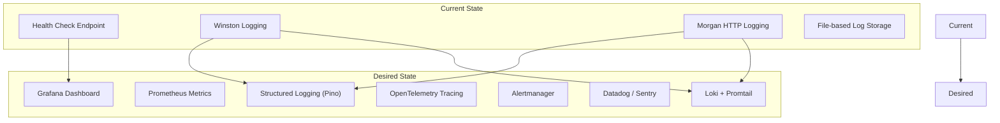

# 16. Observability Documentation

## Observability Strategy

```mermaid
graph TB
    subgraph "Observability Pillars"
        L[Logging]
        M[Metrics]
        T[Tracing]
    end
    
    subgraph "Current Implementation"
        WL[Winston Logger]
        ML[Morgan HTTP Logger]
    end
    
    subgraph "Gaps"
        NM[No Metrics System]
        NT[No Distributed Tracing]
        NA[No Alerting]
        ND[No Dashboard]
    end
    
    L --> WL
    L --> ML
    M --> NM
    T --> NT
    
    WL --> EL[Error Log File]
    WL --> CL[Combined Log File]
    WL --> CO[Console (non-prod)]
```

## Logging

### Winston Configuration

| Property | Value |
|----------|-------|
| **Log Level** | `LOG_LEVEL` env var (default: `info`) |
| **Format** | JSON with timestamp, error stack, service name |
| **Default Meta** | `{ service: 'acquisitions-api' }` |
| **Error File** | `logs/error.lg` (error level only) |
| **Combined File** | `logs/combined.log` (all levels) |
| **Console** | Colorized, simple format (non-production only) |

### Log Events (from source analysis)

| Event | Level | Location |
|-------|-------|----------|
| Server started | info | `src/server.js:5` |
| Hello from Acquisitions | info | `src/app.js:24` |
| User registered | info | `src/controllers/auth.controller.js:22` |
| User signed in | info | `src/controllers/auth.controller.js:50` |
| User signed out | info | `src/controllers/auth.controller.js:68` |
| Users retrieved | info | `src/controllers/users.controller.js:8` |
| User updated | info | `src/controllers/users.controller.js:54` |
| User deleted | info | `src/controllers/users.controller.js:77` |
| Bot blocked | warn | `src/middleware/security.middleware.js:15` |
| Rate limit exceeded | warn | `src/middleware/security.middleware.js:22` |
| Shield blocked | warn | `src/middleware/security.middleware.js:18` |
| Auth denied (wrong role) | warn | `src/middleware/auth.middleware.js:21` |
| Signup error | error | `src/controllers/auth.controller.js:27` |
| Signin error | error | `src/controllers/auth.controller.js:55` |
| Auth error | error | `src/middleware/auth.middleware.js:14` |
| DB errors | error | `src/services/*.js` |

### Morgan Integration

Morgan HTTP request logs are piped through Winston:

```javascript
app.use(
  morgan('combined', {
    stream: { write: message => logger.info(message.trim()) },
  })
);
```

This means all HTTP requests are logged as `info` level with the Apache combined format.

## Metrics

**Not implemented.** The project does not include:
- Prometheus metrics
- Application performance monitoring (APM)
- Business metrics (registrations, active users)
- System metrics (CPU, memory, request latency)

## Tracing

**Not implemented.** The project does not include:
- Distributed tracing (OpenTelemetry, Jaeger, Zipkin)
- Request ID propagation
- Span collection

## Monitoring

**Not implemented.** The project does not include:
- Health check endpoint (`GET /health`) — exists and is used by Docker
- Uptime monitoring — no external monitoring configured
- Alerting — no rules defined
- Dashboard — no Grafana/DataDog configuration

## Alerting Strategy

**Not defined.** No alerting is configured. Recommendations:

| Alert | Condition | Severity | Channel |
|-------|-----------|----------|---------|
| **Service Down** | Health check fails 3x | P1 | Email/Slack/PagerDuty |
| **Error Rate Spike** | >5% error responses in 5min | P2 | Slack |
| **Rate Limit Hits** | >100 rate limit blocks in 5min | P2 | Slack |
| **High Latency** | p95 > 2s | P3 | Slack |
| **Failed Auth Attempts** | >10 failed signins in 1min | P2 | Slack |

## Observability Gap Analysis



## Source Files Evidence

| Component | File | Line(s) |
|-----------|------|---------|
| Winston config | `src/config/logger.js` | All |
| Morgan integration | `src/app.js` | 21-24 |
| Health endpoint | `src/app.js` | 27-33 |
| Log files | `logs/combined.log`, `logs/error.lg` | All |
| Service meta | `src/config/logger.js` | 10 |
