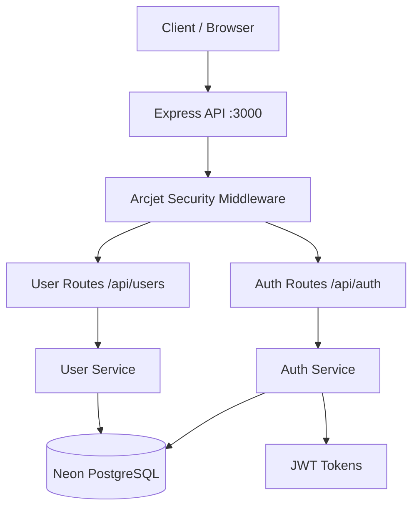

# 1. Executive Summary

## One-Paragraph Summary (Leadership)

> Acquisitions is a production-ready REST API backend for user authentication and management, built with Node.js and Express 5. It provides secure user registration, login, role-based access control, and user CRUD operations, backed by a Neon serverless PostgreSQL database via Drizzle ORM. The system is containerized with Docker, includes CI/CD pipelines via GitHub Actions, and features enterprise-grade security through Arcjet (rate limiting, bot detection, shield protection). Designed as a reference architecture and starter kit — associated with the JavaScript Mastery educational ecosystem — it demonstrates modern backend development practices including JWT authentication, Zod validation, Winston logging, and multi-environment Docker deployments.

## What This Project Does

- Provides a RESTful API for user authentication (signup, signin, signout)
- Manages user profiles with CRUD operations (create, read, update, delete)
- Enforces role-based access control (admin vs regular user)
- Implements security layers (rate limiting, bot detection, helmet headers, CORS)
- Serves as a containerized, CI/CD-ready backend starter

## Why It Exists

- Educational reference architecture from the JavaScript Mastery community
- Demonstrates production-grade Node.js backend patterns
- Provides a reusable authentication and user management system
- Shows how to integrate modern tools (Arcjet, Neon, Drizzle, Docker)

## Who Uses It

| Role | Usage |
|------|-------|
| **Developers** | Learning modern Node.js/Express backend patterns |
| **Students** | Following JavaScript Mastery tutorials |
| **Startup Teams** | Using as a foundation for their own backend |
| **DevOps Engineers** | Studying Docker/CI-CD configurations |

## Business Problem Solved

- Eliminates the need to build authentication from scratch for new projects
- Provides a production-ready security baseline
- Reduces time-to-market for user management features
- Demonstrates cloud-native serverless database integration

## Primary Value Proposition

A secure, production-ready, containerized backend API that can be deployed anywhere — from a developer's laptop to Kubernetes in the cloud — with minimal configuration changes.

## Key Features

- **JWT Authentication** — Secure token-based auth via httpOnly cookies
- **Role-Based Access Control** — Admin vs user permissions
- **Serverless Database** — Neon PostgreSQL with Drizzle ORM
- **Rate Limiting** — Role-aware rate limiting via Arcjet (20/min admin, 10/min user, 5/min guest)
- **Bot Detection** — Arcjet Shield blocks automated/bot traffic
- **Security Headers** — Helmet.js for HTTP security headers
- **Validation** — Zod schema validation for all inputs
- **Logging** — Winston structured logging to files and console
- **Docker Support** — Multi-stage Docker builds with dev/prod compositions
- **CI/CD** — GitHub Actions for linting, testing, and Docker image builds

## High-Level System Overview

## Technical Summary

| Aspect | Detail |
|--------|--------|
| **Language** | JavaScript (ES Modules) |
| **Runtime** | Node.js (version: 18+, tested on 20.x in CI) |
| **Framework** | Express 5 |
| **Database** | Neon Serverless PostgreSQL |
| **ORM** | Drizzle ORM |
| **Auth** | JWT (jsonwebtoken) via httpOnly cookies |
| **Validation** | Zod |
| **Security** | Arcjet (rate limit, bot detection, shield) + Helmet |
| **Logging** | Winston |
| **Container** | Docker (multi-stage builds) |
| **CI/CD** | GitHub Actions |
| **Port** | 3000 (default) |

## Source Files Evidence

| Conclusion | Source |
|-----------|--------|
| Express 5 usage | `src/app.js` — `import express from 'express'` |
| JWT auth flow | `src/middleware/auth.middleware.js` |
| Database configuration | `src/config/database.js` |
| Arcjet security | `src/config/arcjet.js`, `src/middleware/security.middleware.js` |
| Docker multi-stage | `Dockerfile` — `FROM base AS development` / `FROM base AS production` |
| CI/CD pipelines | `.github/workflows/tests.yml`, `docker-build-and-push.yml`, `lint-and-format.yml` |
| Zod validation | `src/validations/auth.validation.js`, `src/validations/users.validation.js` |
