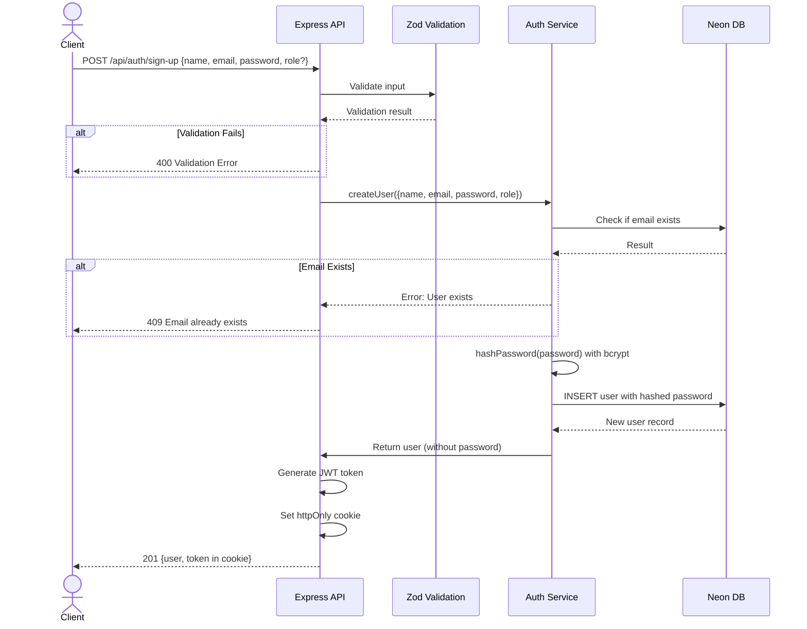
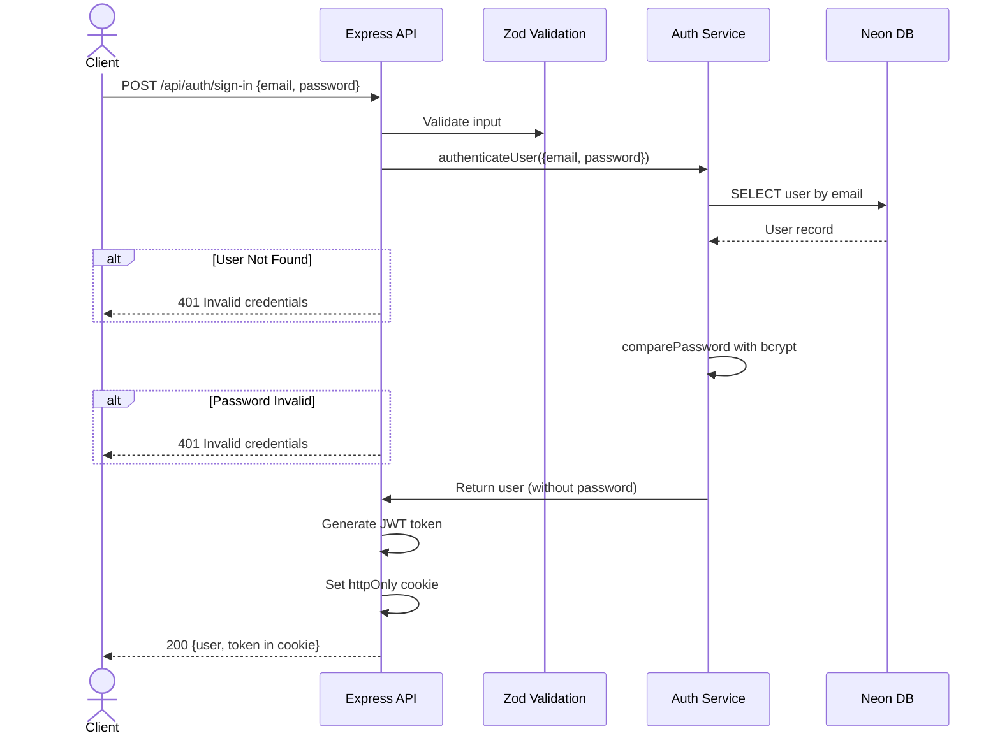
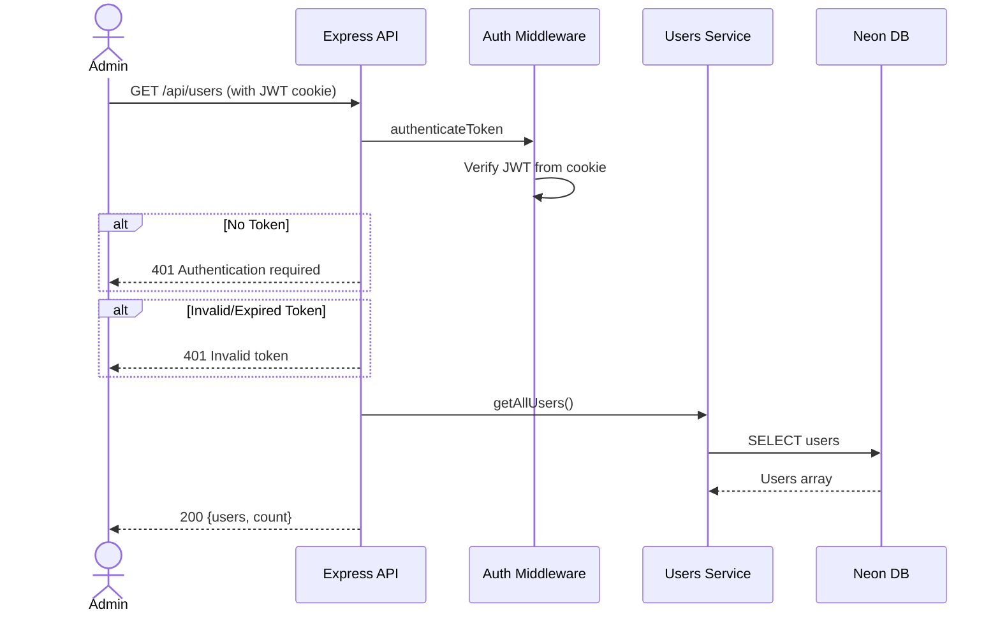
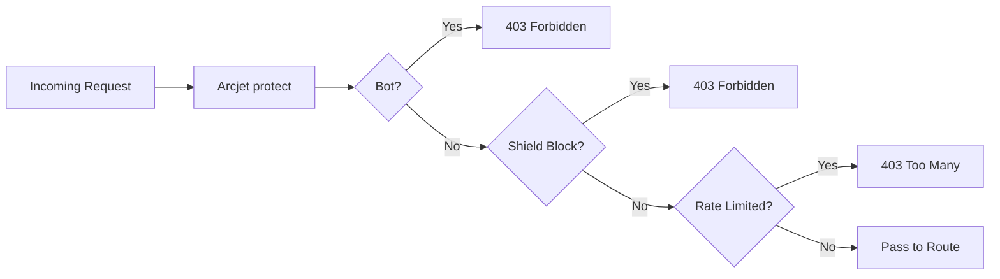

# 2. Business Documentation

## Problem Statement

Developers and teams building web applications repeatedly face the same foundational challenge: implementing a secure, production-ready authentication and user management system. This includes:

- User registration and login with password hashing
- Secure session management via JWT
- Role-based access control
- Input validation and sanitization
- Protection against common attacks (bots, rate limiting, injection)
- Database schema design for user data
- Deployment infrastructure for development and production

Without a reference implementation, each team starts from scratch — introducing inconsistencies, security gaps, and wasted engineering effort.

**Acquisitions solves this** by providing a production-grade, fully-documented, containerized backend API that can be used as a starter kit or reference architecture.

## Business Goals

### Engineering Productivity Goals

- Provide a reusable auth/user management system (reduces build time by ~2-3 weeks for new projects)
- Establish coding standards and patterns (ES modules, import maps, Zod validation, layered architecture)
- Enable rapid local development with Docker and Neon Local proxy
- Demonstrate CI/CD integration patterns

### Security & Quality Goals

- Implement defense-in-depth security (Arcjet + Helmet + JWT cookies + Zod validation)
- Achieve test coverage for critical paths (health, API status, routing)
- Follow OWASP security best practices
- Maintain clean, linted codebase (ESLint + Prettier enforced in CI)

### Educational Goals

- Serve as a teaching tool for JavaScript Mastery content
- Demonstrate modern backend tooling integration
- Provide real-world architecture patterns for students

## Stakeholders

| Stakeholder            | Interest                              | Impact                                       |
| ---------------------- | ------------------------------------- | -------------------------------------------- |
| **End Users**          | API consumers building applications   | Receives clean, documented API for auth      |
| **Developers**         | Use as starter kit or reference       | Saves development time, provides patterns    |
| **JavaScript Mastery** | Educational content creator           | Uses as tutorial project                     |
| **DevOps Engineers**   | Deploy and maintain                   | Studies Docker/CI-CD configuration           |
| **Security Engineers** | Review security posture               | Evaluates Arcjet, Helmet, JWT implementation |
| **Hiring Managers**    | Evaluate candidate project complexity | Assesses architecture decisions              |

## User Personas

### Persona 1: The Learner (Alex)

- **Background**: Junior developer, knows basic JavaScript
- **Goals**: Learn production Node.js patterns, understand auth flows
- **Pain Points**: Overwhelmed by configuration complexity
- **How they use Acquisitions**: Follows README, studies code, runs locally

### Persona 2: The Startup Founder (Priya)

- **Background**: Technical founder, full-stack developer
- **Goals**: Ship MVP quickly with solid auth
- **Pain Points**: Needs secure auth without building from scratch
- **How they use Acquisitions**: Clones repo, customizes, deploys to production

### Persona 3: The DevOps Engineer (Jordan)

- **Background**: Infrastructure specialist
- **Goals**: Evaluate Docker setup, CI/CD patterns
- **Pain Points**: Ensuring production readiness
- **How they use Acquisitions**: Reviews Dockerfiles, compose files, GitHub Actions

### Persona 4: The Technical Interviewer (Sam)

- **Background**: Senior engineer at tech company
- **Goals**: Assess candidate's system design knowledge
- **Pain Points**: Finding realistic reference projects
- **How they use Acquisitions**: Studies architecture as interview reference

## Business Workflows

### Workflow 1: User Registration

**Trigger**: Client submits registration form
**Actors**: Client (browser/app), API, Database
**Inputs**: name (string), email (valid email), password (6-128 chars), role (optional, default 'user')
**Outputs**: 201 Created with user object, JWT cookie set
**Success Path**: Validation → Email unique → Password hashed → User created → JWT issued → Response
**Failure Paths**: Validation error (400), Email exists (409), Server error (500)

### Workflow 2: User Sign-In

**Trigger**: Client submits login form
**Actors**: Client, API, Database
**Inputs**: email, password
**Outputs**: 200 Success with user object, JWT cookie set
**Success Path**: Validation → User found → Password matched → JWT issued → Response
**Failure Paths**: User not found (401), Wrong password (401), Validation error (400)

### Workflow 3: User Management (CRUD)

**Trigger**: Authenticated user/admin requests user data
**Actors**: Authenticated user, API, Auth middleware, Database
**Inputs**: JWT cookie (from previous auth)
**Outputs**: User data or error
**Success Path**: Valid token → Authorized → Data retrieval → Response
**Failure Paths**: No token (401), Invalid token (401), Not authorized for delete (403)

### Workflow 4: Security Middleware Processing

Every request flows through the Arcjet security middleware:

## Source Files Evidence

| Workflow             | Key Files                                                                   |
| -------------------- | --------------------------------------------------------------------------- |
| Registration/Sign-In | `src/controllers/auth.controller.js`, `src/services/auth.service.js`        |
| User CRUD            | `src/controllers/users.controller.js`, `src/services/users.service.js`      |
| Authentication       | `src/middleware/auth.middleware.js`, `src/utils/jwt.js`                     |
| Security             | `src/middleware/security.middleware.js`, `src/config/arcjet.js`             |
| Validation           | `src/validations/auth.validation.js`, `src/validations/users.validation.js` |
