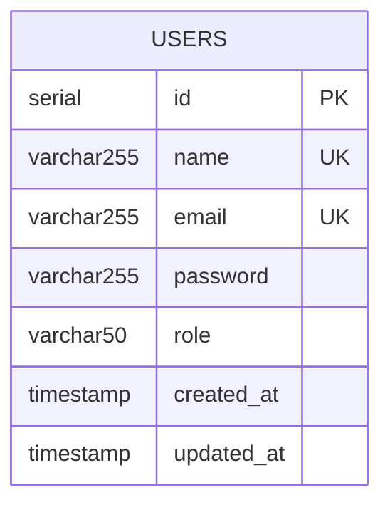

# 10. Database Documentation

## Database Technology

| Property | Value |
|----------|-------|
| **Database** | PostgreSQL (via Neon Serverless) |
| **ORM** | Drizzle ORM |
| **Migration Tool** | Drizzle Kit |
| **Connection** | `@neondatabase/serverless` |
| **Environment** | Dev: Neon Local Proxy | Prod: Neon Cloud |

## Schema

### Table: `users`

```sql
CREATE TABLE "users" (
  "id" serial PRIMARY KEY NOT NULL,
  "name" varchar(255) NOT NULL,
  "email" varchar(255) NOT NULL,
  "password" varchar(255) NOT NULL,
  "role" varchar(50) DEFAULT 'user' NOT NULL,
  "created_at" timestamp DEFAULT now() NOT NULL,
  "updated_at" timestamp DEFAULT now() NOT NULL,
  CONSTRAINT "users_email_unique" UNIQUE("email")
);
```

### Column Details

| Column | Type | Constraints | Default | Notes |
|--------|------|-------------|---------|-------|
| `id` | `serial` | PRIMARY KEY | auto-increment | Internal identifier |
| `name` | `varchar(255)` | NOT NULL | - | User's display name |
| `email` | `varchar(255)` | NOT NULL, UNIQUE | - | Login identifier, lowercased |
| `password` | `varchar(255)` | NOT NULL | - | bcrypt hash (not raw password) |
| `role` | `varchar(50)` | NOT NULL | 'user' | 'user' or 'admin' |
| `created_at` | `timestamp` | NOT NULL | `now()` | Row creation time |
| `updated_at` | `timestamp` | NOT NULL | `now()` | Row last update time |

### Constraints

| Constraint | Type | Purpose |
|-----------|------|---------|
| `users_pkey` (id) | Primary Key | Unique row identification |
| `users_email_unique` | Unique Index | Prevent duplicate registrations |

### Indexes

**Not enough evidence found in repository.** The `drizzle/meta/0000_snapshot.json` confirms no additional indexes beyond the primary key and unique email constraint. No performance indexes on `created_at`, `role`, or `name` exist.

## Entity Relationship Diagram



**Note**: The database currently has only one table. No relationships exist yet.

## Data Flow Diagram

```mermaid
flowchart TB
    subgraph "Application"
        CRUD[User CRUD Operations]
        AUTH[Authentication Operations]
    end
    
    subgraph "Drizzle ORM"
        INSERT[db.insert(users).values()]
        SELECT[db.select().from(users)]
        UPDATE[db.update(users).set()]
        DELETE[db.delete(users)]
    end
    
    subgraph "Neon Database"
        TBL["Table: users"]
        IDX["Index: email_unique"]
    end
    
    subgraph "Queries"
        Q1["INSERT INTO users (name, email, password, role) VALUES (...) RETURNING ..."]
        Q2["SELECT id, name, email, role, ... FROM users WHERE email = ? LIMIT 1"]
        Q3["SELECT ... FROM users WHERE id = ? LIMIT 1"]
        Q4["SELECT ... FROM users"]
        Q5["UPDATE users SET ... WHERE id = ? RETURNING ..."]
        Q6["DELETE FROM users WHERE id = ? RETURNING ..."]
    end
    
    CRUD --> SELECT
    CRUD --> INSERT
    CRUD --> UPDATE
    CRUD --> DELETE
    
    AUTH --> SELECT
    
    INSERT --> Q1
    SELECT --> Q2
    SELECT --> Q3
    SELECT --> Q4
    UPDATE --> Q5
    DELETE --> Q6
    
    Q1 --> TBL
    Q2 --> TBL
    Q3 --> TBL
    Q4 --> TBL
    Q5 --> TBL
    Q6 --> TBL
    
    TBL --> IDX
```

## Query Analysis

| Operation | Method | SQL Pattern | Frequency | Performance |
|-----------|--------|-------------|-----------|-------------|
| Create user | `db.insert().values().returning()` | INSERT + RETURNING | Low (registrations) | Fast, indexed by PK |
| Find by email | `db.select().where(eq(users.email, email)).limit(1)` | SELECT ... WHERE email = ? | High (every sign-in) | Fast, email is unique indexed |
| Find by ID | `db.select().where(eq(users.id, id)).limit(1)` | SELECT ... WHERE id = ? | High (profile views) | Fast, PK lookup |
| List all | `db.select().from(users)` | SELECT ... FROM users | Medium (admin) | Table scan, no pagination |
| Update user | `db.update().set().where().returning()` | UPDATE ... WHERE id = ? | Medium (profile edits) | Fast, PK lookup |
| Delete user | `db.delete().where().returning()` | DELETE ... WHERE id = ? | Low (admin) | Fast, PK lookup |

## Why This Schema Design

| Decision | Rationale | Evidence |
|----------|-----------|----------|
| Single `users` table | Only domain entity needed for auth | `src/models/user.model.js` |
| `serial` primary key | Auto-incrementing integer, standard Postgres | `user.model.js:3` |
| `varchar` for role | Simple string enum (no Postgres enum type) | `user.model.js:7` |
| `timestamp` with `defaultNow()` | Automatic timestamps at ORM level | `user.model.js:8-9` |
| Unique constraint on email | Enforced at DB level (defense in depth) | Migration SQL + Zod validation |

## Performance Implications

| Concern | Impact | Recommendation |
|---------|--------|---------------|
| No pagination | `SELECT * FROM users` returns all rows — scales poorly | Add LIMIT/OFFSET or cursor pagination |
| No composite indexes | Queries only use PK and email index | Add idx on role, created_at for admin queries |
| Serial PK | Single-writer contention at high scale | Consider UUID v7 or ULID for distributed |
| varchar(255) for all | Small overhead for email/name/role | Appropriate for current scale |
| Neon Serverless | Cold starts on idle, connection pooling | Use Neon's pooler URL (already configured) |

## Scaling Implications

| Scenario | Current State | Limitation | Recommendation |
|----------|--------------|------------|---------------|
| 100 users | Fine | None | - |
| 10K users | Fine | No pagination | Add pagination |
| 1M users | Slowing | Table scan listing | Add LIMIT, composite indexes |
| 10M users | Problematic | Single table, no sharding | Consider read replicas, sharding |
| Global distribution | Not supported | Single region Neon | Multi-region Neon or alternative |

## Migration History

| Migration | Tag | Applied | Changes |
|-----------|-----|---------|---------|
| 0000 | `happy_bedlam` | 2026-06-07 (timestamp: 1757174026586) | Initial `users` table creation |

## Source Files Evidence

| Component | File | Line(s) |
|-----------|------|---------|
| Drizzle schema | `src/models/user.model.js` | All |
| DB connection | `src/config/database.js` | All |
| Migration SQL | `drizzle/0000_happy_bedlam.sql` | All |
| Migration journal | `drizzle/meta/_journal.json` | All |
| Migration snapshot | `drizzle/meta/0000_snapshot.json` | All |
| Drizzle config | `drizzle.config.js` | All |
| INSERT queries | `src/services/auth.service.js` | 26-42 |
| SELECT queries | `src/services/users.service.js` | All |
| UPDATE/DELETE | `src/services/users.service.js` | 28-55 |
