# Dependency Graph of Modules

## Module Dependency Visualization

```mermaid
graph TB
    subgraph "Entry Point"
        INDEX["src/index.js"]
        SERVER["src/server.js"]
    end

    subgraph "Express Application"
        APP["src/app.js"]
    end

    subgraph "Configuration"
        DB["src/config/database.js"]
        LOG["src/config/logger.js"]
        ARCJET["src/config/arcjet.js"]
    end

    subgraph "Routes"
        AUTH_ROUTES["src/routes/auth.routes.js"]
        USER_ROUTES["src/routes/users.routes.js"]
    end

    subgraph "Middlewares"
        AUTH_MW["src/middleware/auth.middleware.js"]
        SEC_MW["src/middleware/security.middleware.js"]
    end

    subgraph "Controllers"
        AUTH_CTRL["src/controllers/auth.controller.js"]
        USER_CTRL["src/controllers/users.controller.js"]
    end

    subgraph "Services"
        AUTH_SVC["src/services/auth.service.js"]
        USER_SVC["src/services/users.service.js"]
    end

    subgraph "Models"
        USER_MODEL["src/models/user.model.js"]
    end

    subgraph "Validations"
        AUTH_VAL["src/validations/auth.validation.js"]
        USER_VAL["src/validations/users.validation.js"]
    end

    subgraph "Utilities"
        JWT["src/utils/jwt.js"]
        COOKIES["src/utils/cookies.js"]
        FORMAT["src/utils/format.js"]
    end

    subgraph "External Dependencies"
        EXPRESS["express"]
        ARCIET_NODE["@arcjet/node"]
        NEON_DB["@neondatabase/serverless"]
        DRIZZLE["drizzle-orm"]
        BCRYPT["bcrypt"]
        JWT_LIB["jsonwebtoken"]
        HELMET["helmet"]
        CORS["cors"]
        MORGAN["morgan"]
        WINSTON["winston"]
        ZOD["zod"]
        COOKIE_PARSER["cookie-parser"]
        DOTENV["dotenv"]
    end

    %% App initialization
    INDEX --> SERVER
    SERVER --> APP
    SERVER --> DOTENV

    %% App configuration
    APP --> LOG
    APP --> HELMET
    APP --> CORS
    APP --> COOKIE_PARSER
    APP --> MORGAN
    APP --> SEC_MW

    %% Route mounting
    APP --> AUTH_ROUTES
    APP --> USER_ROUTES

    %% Route → Controller
    AUTH_ROUTES --> AUTH_CTRL
    USER_ROUTES --> USER_CTRL

    %% Middleware application
    USER_ROUTES --> AUTH_MW
    USER_ROUTES --> SEC_MW
    AUTH_ROUTES --> SEC_MW

    %% Auth middleware dependencies
    AUTH_MW --> JWT
    AUTH_MW --> LOG

    %% Security middleware dependencies
    SEC_MW --> ARCJET

    %% Controller dependencies
    AUTH_CTRL --> LOG
    AUTH_CTRL --> AUTH_VAL
    AUTH_CTRL --> FORMAT
    AUTH_CTRL --> AUTH_SVC
    AUTH_CTRL --> JWT
    AUTH_CTRL --> COOKIES

    USER_CTRL --> LOG
    USER_CTRL --> USER_VAL
    USER_CTRL --> FORMAT
    USER_CTRL --> USER_SVC

    %% Service dependencies
    AUTH_SVC --> LOG
    AUTH_SVC --> BCRYPT
    AUTH_SVC --> DB
    AUTH_SVC --> USER_MODEL
    AUTH_SVC --> DRIZZLE

    USER_SVC --> LOG
    USER_SVC --> DB
    USER_SVC --> USER_MODEL
    USER_SVC --> DRIZZLE

    %% Config dependencies
    DB --> NEON_DB
    DB --> DRIZZLE
    LOG --> WINSTON
    ARCJET --> ARCIET_NODE

    %% Utility dependencies
    JWT --> JWT_LIB
    JWT --> LOG
    COOKIES --> LOG

    %% Validation dependencies
    AUTH_VAL --> ZOD
    USER_VAL --> ZOD
```

## Top 20 Most Critical Files

| Rank | File                                    | Dependents                             | Dependency Count | Criticality Score | Reason                                           |
| ---- | --------------------------------------- | -------------------------------------- | ---------------- | ----------------- | ------------------------------------------------ |
| 1    | `src/app.js`                            | 20+ (all routes and middleware)        | 12               | 10/10             | Central Express app, every request flows through |
| 2    | `src/services/auth.service.js`          | 2 (auth controller, auth routes)       | 5                | 9.5/10            | Core auth logic, password hashing, JWT issuance  |
| 3    | `src/middleware/auth.middleware.js`     | 3 (user routes, auth controller)       | 2                | 9.5/10            | All protected routes depend on this              |
| 4    | `src/config/database.js`                | 2 (auth service, user service)         | 2                | 9.0/10            | All data access goes through this                |
| 5    | `src/controllers/auth.controller.js`    | 1 (auth routes)                        | 5                | 9.0/10            | Auth request handling, token issuance            |
| 6    | `src/middleware/security.middleware.js` | 1 (app.js)                             | 2                | 8.5/10            | Global security enforcement                      |
| 7    | `src/utils/jwt.js`                      | 2 (auth middleware, auth controller)   | 2                | 8.5/10            | All auth relies on JWT                           |
| 8    | `src/services/users.service.js`         | 1 (user controller)                    | 4                | 8.0/10            | All user CRUD operations                         |
| 9    | `src/config/arcjet.js`                  | 1 (security middleware)                | 1                | 8.0/10            | Security configuration                           |
| 10   | `src/controllers/users.controller.js`   | 1 (user routes)                        | 4                | 8.0/10            | User CRUD request handling                       |
| 11   | `src/config/logger.js`                  | 8+ (app.js, all controllers, services) | 1                | 7.5/10            | Logging across the app                           |
| 12   | `src/models/user.model.js`              | 2 (auth service, user service)         | 0                | 7.5/10            | Database schema definition                       |
| 13   | `src/validations/auth.validation.js`    | 1 (auth controller)                    | 1                | 7.0/10            | Auth input validation                            |
| 14   | `src/validations/users.validation.js`   | 1 (user controller)                    | 1                | 7.0/10            | User input validation                            |
| 15   | `src/utils/cookies.js`                  | 1 (auth controller)                    | 0                | 6.5/10            | Cookie management                                |
| 16   | `src/routes/auth.routes.js`             | 1 (app.js)                             | 1                | 6.0/10            | Auth route mapping                               |
| 17   | `src/routes/users.routes.js`            | 1 (app.js)                             | 1                | 6.0/10            | User route mapping                               |
| 18   | `src/utils/format.js`                   | 2 (auth controller, user controller)   | 0                | 5.0/10            | Error formatting                                 |
| 19   | `src/server.js`                         | 1 (index.js)                           | 1                | 5.0/10            | Server boot                                      |
| 20   | `src/index.js`                          | 0                                      | 2                | 4.0/10            | Entry point                                      |

## Dependency Analysis Summary

| Metric                      | Value                                                     |
| --------------------------- | --------------------------------------------------------- |
| Total source files          | 20                                                        |
| Total external dependencies | 14                                                        |
| Total dev dependencies      | 5                                                         |
| Tightest coupling           | `src/services/auth.service.js` ↔ `src/config/database.js` |
| Most reused module          | `src/config/logger.js` (used by 8+ files)                 |
| Leaf modules (no deps)      | `user.model.js`, `format.js`, `cookies.js`                |
| Entry points                | `src/index.js` → `src/server.js` → `src/app.js`           |
