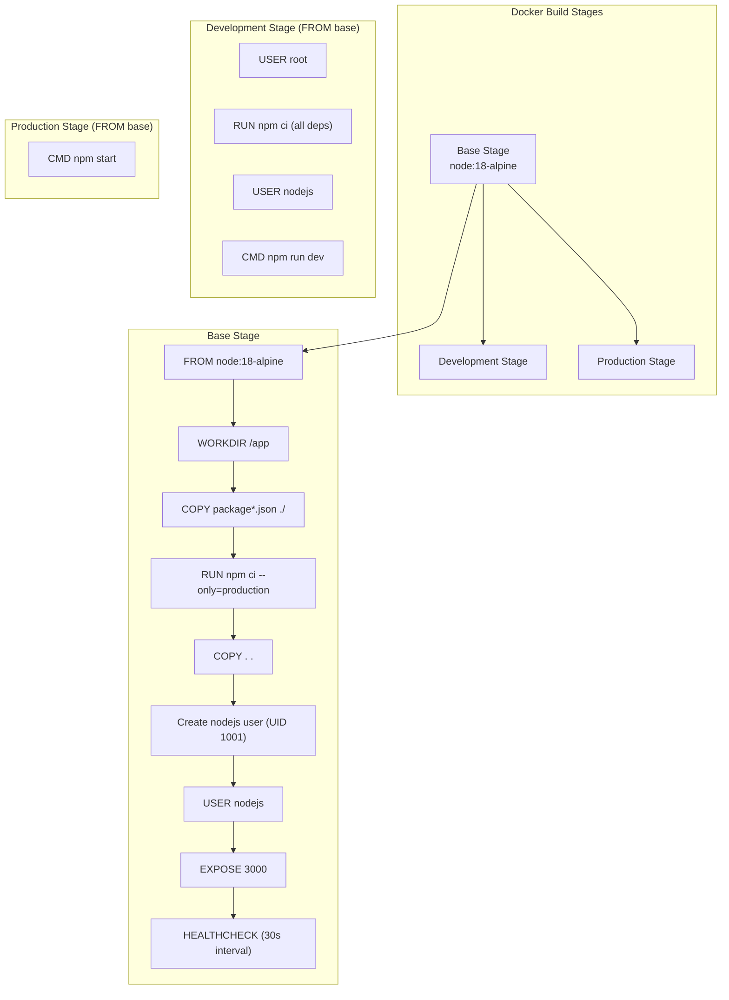
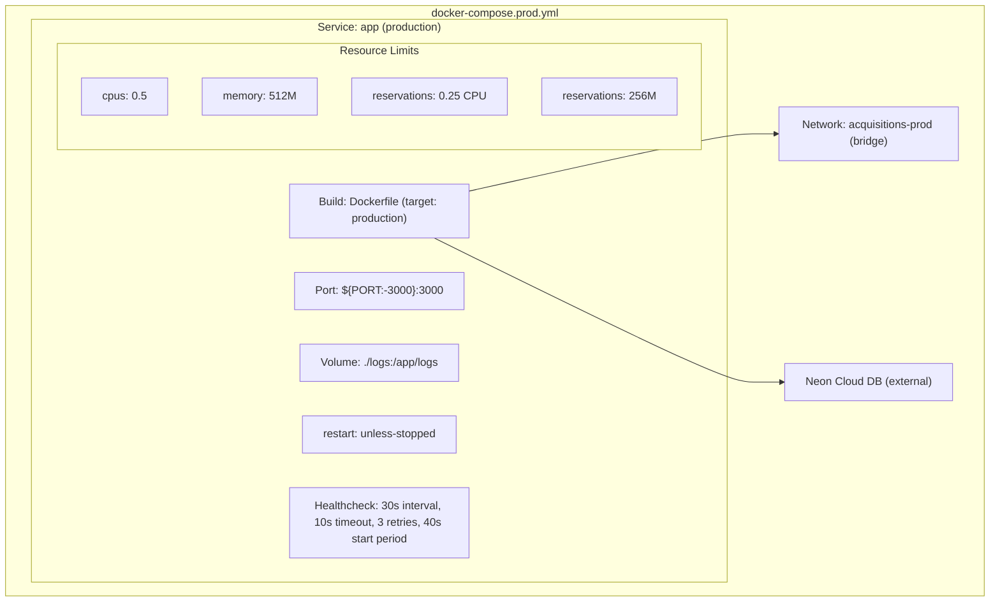
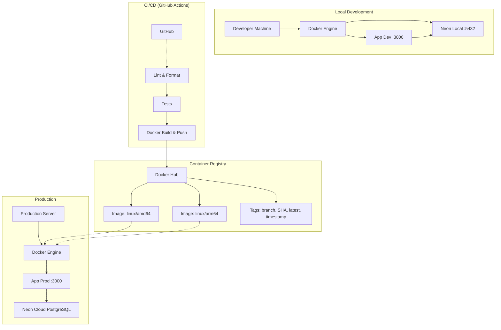
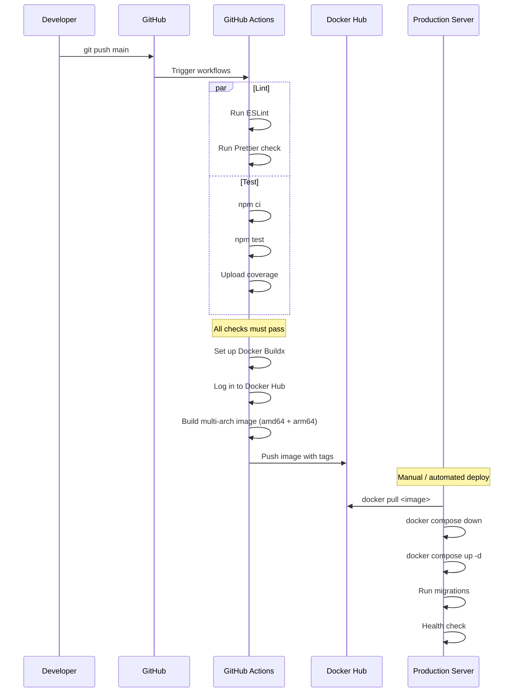

# 11. Infrastructure Documentation

## Deployment Strategy

The project uses a **multi-environment Docker deployment** strategy:

| Environment | Database | Configuration | Purpose |
|-------------|----------|---------------|---------|
| **Development** | Neon Local (ephemeral proxy) | `.env.development` | Local development with hot-reload |
| **Production** | Neon Cloud (serverless) | `.env.production` | Production deployment |
| **CI/CD** | Ephemeral (GitHub Actions) | Inline env vars | Automated testing |

## Containers

### Dockerfile (Multi-Stage Build)



| Stage | Key Characteristics |
|-------|---------------------|
| **Base** | Production deps only (`npm ci --only=production`), non-root user, healthcheck |
| **Development** | Full dependencies (including dev), hot-reload via nodemon-like `--watch` |
| **Production** | Minimal image, production deps only, production entrypoint |

**Security Features in Dockerfile**:
- Non-root user (`nodejs`) for defense-in-depth
- Healthcheck for container orchestration
- `npm ci` for deterministic installs
- Cache clean after install

## Docker Compose: Development

```mermaid
graph TB
    subgraph "docker-compose.dev.yml"
        Direction TB
        
        subgraph "Service: neon-local"
            NL["Image: neondatabase/neon_local:latest"]
            NLP["Port: 5432:5432"]
            NLV["Volume: .neon_local/"]
            NLHC["Healthcheck: pg_isready"]
        end
        
        subgraph "Service: app (development)"
            DevApp["Build: Dockerfile (target: development)"]
            DevP["Port: ${PORT:-3000}:3000"]
            Vol1["Volume: .:/app"]
            Vol2["Volume: /app/node_modules"]
            Vol3["Volume: ./logs:/app/logs"]
            Dep["depends_on: neon-local (healthy)"]
            Restart["restart: unless-stopped"]
        end
        
        Net["Network: acquisitions-dev (bridge)"]
        
        DevApp --> NL
        NL --> Net
        DevApp --> Net
    end
```

**Development Features**:
- **Neon Local**: Ephemeral PostgreSQL proxy with database branching
- **Hot Reload**: Volume mounts enable live code changes
- **Node Modules Volume**: Prevents host/node_modules conflicts
- **Logs Volume**: Persists logs outside container
- **Health Check Dependency**: App waits for database readiness

## Docker Compose: Production



**Production Features**:
- Resource limits (CPU/memory reservations + hard limits)
- Health check with longer start period (40s for cold starts)
- Direct connection to Neon Cloud (no local proxy)
- Logs persistence volume
- Restart policy: unless-stopped

## Infrastructure Diagram



## Deployment Flow



## Source Files Evidence

| Component | File |
|-----------|------|
| Multi-stage Dockerfile | `Dockerfile` |
| Dev compose | `docker-compose.dev.yml` |
| Prod compose | `docker-compose.prod.yml` |
| Docker ignore | `.dockerignore` |
| Dev startup script | `scripts/dev.sh` |
| Prod startup script | `scripts/prod.sh` |
| CI/CD Docker build | `.github/workflows/docker-build-and-push.yml` |
