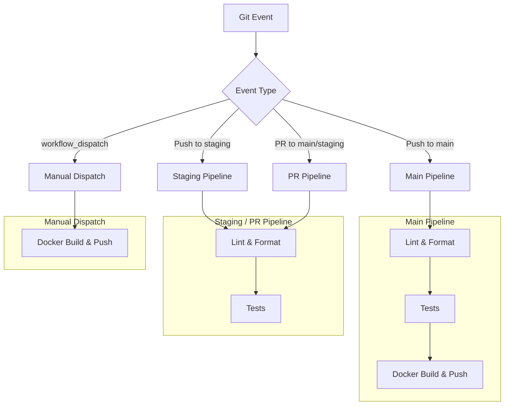
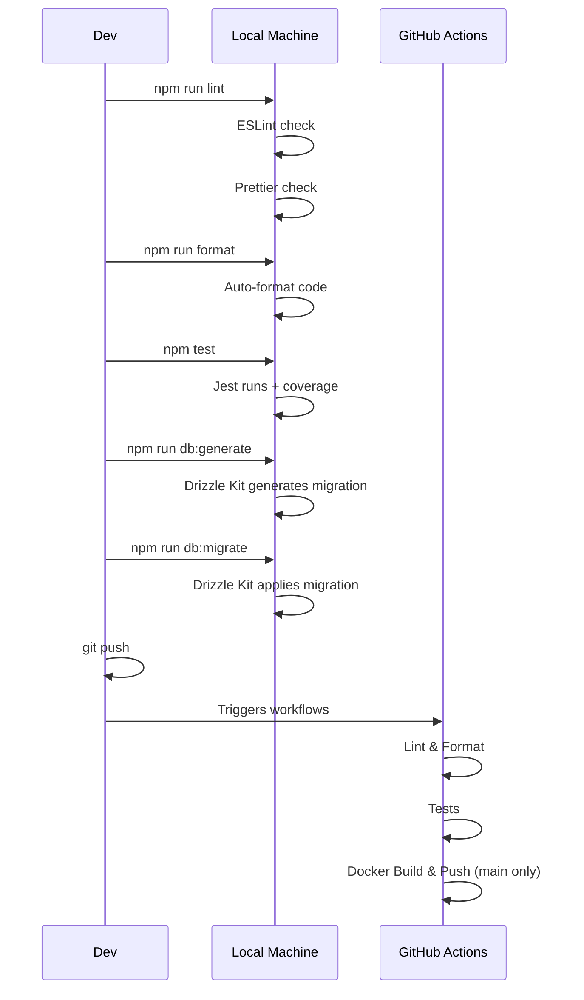

# 12. DevOps Documentation

## CI/CD Pipelines

### Pipeline Overview



### Workflow 1: Lint and Format Check

**File**: `.github/workflows/lint-and-format.yml`

| Property     | Value                                       |
| ------------ | ------------------------------------------- | -------------------------- | --------- | --------------- | ----------------------- |
| **Triggers** | Push and PR to `main` and `staging`         |
| **Runner**   | ubuntu-latest                               |
| **Node**     | 20.x                                        |
| **Steps**    | 1. Checkout                                 | 2. Setup Node (with cache) | 3. npm ci | 4. npm run lint | 5. npm run format:check |
| **Purpose**  | Enforce code quality standards before merge |

### Workflow 2: Tests

**File**: `.github/workflows/tests.yml`

| Property          | Value                                                           |
| ----------------- | --------------------------------------------------------------- | -------------------------- | --------- | ---------------------- | ----------------------------------------------- |
| **Triggers**      | Push and PR to `main` and `staging`                             |
| **Runner**        | ubuntu-latest                                                   |
| **Node**          | 20.x                                                            |
| **Steps**         | 1. Checkout                                                     | 2. Setup Node (with cache) | 3. npm ci | 4. npm test (with env) | 5. Upload coverage artifacts (30-day retention) |
| **Env Variables** | `DATABASE_URL`, `JWT_SECRET`, `LOG_LEVEL=error` (test-specific) |
| **Purpose**       | Run test suite and preserve coverage reports                    |

### Workflow 3: Docker Build and Push

**File**: `.github/workflows/docker-build-and-push.yml`

| Property      | Value                                                                |
| ------------- | -------------------------------------------------------------------- |
| **Triggers**  | Push to `main` and `workflow_dispatch`                               |
| **Runner**    | ubuntu-latest                                                        |
| **Registry**  | Docker Hub (`docker.io`)                                             |
| **Image**     | `${{ secrets.DOCKER_USERNAME }}/kubernetes-demo-api`                 |
| **Platforms** | linux/amd64, linux/arm64                                             |
| **Steps**     |                                                                      |
|               | 1. Checkout                                                          |
|               | 2. Setup Docker Buildx (multi-arch)                                  |
|               | 3. Login to Docker Hub                                               |
|               | 4. Docker metadata (tags: branch, SHA, latest, production timestamp) |
|               | 5. Build and push (multi-platform, with GHA cache)                   |

**Docker Tags Generated**:
| Tag Pattern | Example | Usage |
|-------------|---------|-------|
| `branch-name` | `main` | Latest on branch |
| `sha-<commit>` | `sha-a1b2c3d` | Specific commit |
| `latest` | `latest` | Latest production |
| `timestamp` | `20260621-120000` | Versioned release |

## Build Process



## Release Process

```mermaid
flowchart LR
    subgraph "Development"
        A[Code Changes] --> B[Local Lint/Test]
        B --> C[Commit & Push]
    end

    subgraph "CI Checks"
        C --> D[GitHub Actions Trigger]
        D --> E{Lint Pass?}
        E -->|No| F[Fix and recommit]
        E -->|Yes| G{Tests Pass?}
        G -->|No| F
        G -->|Yes| H{Branch = main?}
    end

    subgraph "Release"
        H -->|Yes| I[Docker Build & Push]
        I --> J[Multi-arch Image Published]
        H -->|No| K[End (staging/PR only)]
    end

    J --> L[Deploy to Production]
```

## Rollback Strategy

**Not enough evidence found in repository.** The project does not define a rollback strategy. Recommendations:

1. **Docker Rollback**: Use previous image tag (`docker compose up -d <app>:<previous-tag>`)
2. **Database Rollback**: Drizzle Kit supports down migrations (`drizzle-kit migrate:down`)
3. **Git Rollback**: `git revert` for code changes
4. **CI/CD Rollback**: Re-run previous successful workflow

## Environment Management

| Environment     | File                             | Source              | Database   | Docker Target |
| --------------- | -------------------------------- | ------------------- | ---------- | ------------- |
| **Development** | `.env.development` (not tracked) | Copy `.env.example` | Neon Local | `development` |
| **Production**  | `.env.production` (not tracked)  | Managed externally  | Neon Cloud | `production`  |
| **Test (CI)**   | Inline in workflow               | GitHub Secrets      | Ephemeral  | N/A           |

## Environment Variable Strategy

```
.env.development      # Local dev (in .gitignore)
.env.production       # Production secrets (in .gitignore)
.env                  # Shared defaults (TRACKED - ⚠️ security risk)
```

**Issue**: `.env` is committed with real secrets. The `.gitignore` only ignores `.env.*` files but NOT `.env`. The `.dockerignore` does exclude `.env*`.

**Recommended Fix**: Never commit `.env` with secrets. Use `.env.example` as template.

## Scripts

### `scripts/dev.sh`

- Checks for `.env.development`
- Verifies Docker is running
- Creates `.neon_local/` directory
- Runs Drizzle migrations
- Waits for database to be ready
- Starts `docker-compose.dev.yml`

### `scripts/prod.sh`

- Checks for `.env.production`
- Verifies Docker is running
- Starts `docker-compose.prod.yml`
- Waits for app health
- Runs migrations

## Source Files Evidence

| Component             | File                                          |
| --------------------- | --------------------------------------------- |
| Lint workflow         | `.github/workflows/lint-and-format.yml`       |
| Test workflow         | `.github/workflows/tests.yml`                 |
| Docker build workflow | `.github/workflows/docker-build-and-push.yml` |
| Dev startup           | `scripts/dev.sh`                              |
| Prod startup          | `scripts/prod.sh`                             |
| Package scripts       | `package.json` (scripts section)              |
