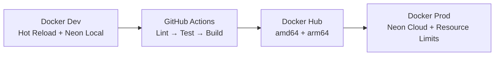

# Executive One-Pager

## Acquisitions API — Project Overview

### What It Is

A production-ready REST API for user authentication and management, built as a reference architecture by the JavaScript Mastery community.

### Tech Stack

- **Runtime**: Node.js 18+ (ES Modules)
- **Framework**: Express 5
- **Database**: Neon Serverless PostgreSQL
- **ORM**: Drizzle
- **Security**: Arcjet + Helmet + JWT
- **Container**: Docker (multi-stage)
- **CI/CD**: GitHub Actions

### Key Features

- JWT authentication with secure httpOnly cookies
- Role-based access control (admin/user)
- Complete user CRUD operations
- Rate limiting (20/min admin, 10/min user, 5/min guest)
- Bot detection and attack shield (Arcjet)
- Input validation (Zod)
- Structured logging (Winston)
- Health monitoring endpoint

### Architecture

```
Routes → Middleware → Controllers → Services → Drizzle ORM → Neon PostgreSQL
```

8 security layers: Helmet → CORS → Arcjet Shield → Bot Detection → Rate Limiting → Zod Validation → JWT Auth → Role Authorization

### Deployment



### Business Value

- Saves 2-3 weeks of auth implementation for new projects
- Production-grade security baseline
- Cloud-native database integration
- Ready for CI/CD and containerized deployment

### Production Readiness: ⚠️ 5.6/10

| ✅ Strengths               | ❌ Critical Issues            |
| -------------------------- | ----------------------------- |
| Clean architecture         | Credentials committed to .env |
| Defense-in-depth security  | Hardcoded JWT secret fallback |
| Docker + CI/CD setup       | Minimal test coverage         |
| Good code organization     | No monitoring/alerting        |
| Import maps for clean code | Permissive CORS               |

### Quick Facts

- **Lines of Code**: ~900 (source) + ~60 (config) + ~30 (tests)
- **Endpoints**: 10
- **Database Tables**: 1 (users)
- **Dependencies**: 14 runtime + 5 dev
- **Docker Image**: ~150MB (production target)

### Contact

- **Project**: JavaScript Mastery (YouTube)
- **Documentation**: `/docs/` directory
- **Issues**: GitHub repository

---

_Generated from repository analysis — June 2026_
