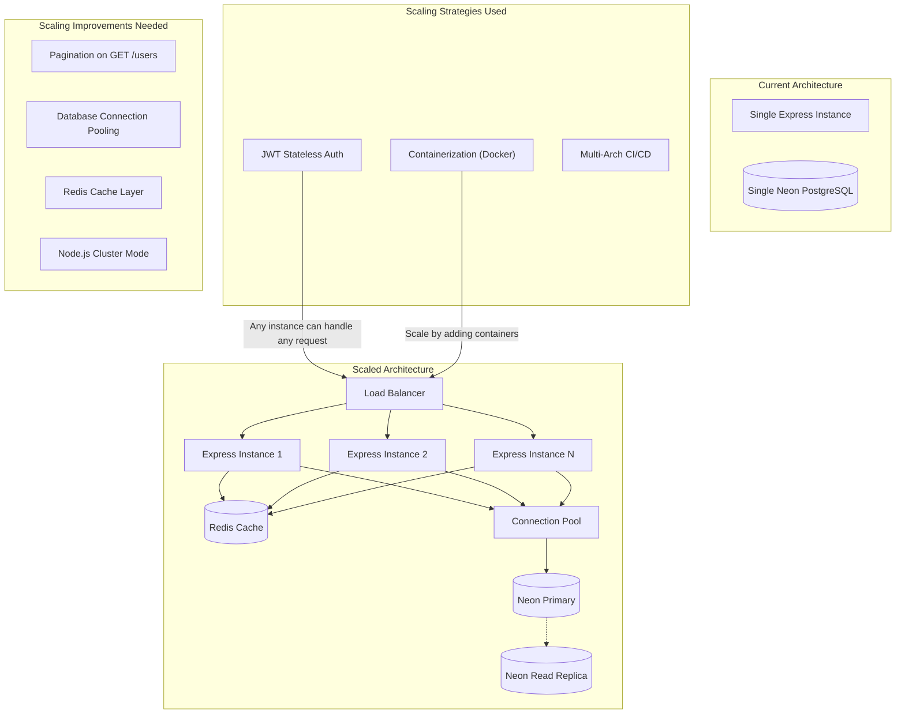

# 25. System Design Interview Mapping

## Scalability

**Evidence**: JWT statelessness (`src/utils/jwt.js`), Docker (`Dockerfile`, `docker-compose.prod.yml`), multi-arch CI (`.github/workflows/docker-build-and-push.yml`).

## Reliability

| Principle                | Implementation                         | Evidence                                |
| ------------------------ | -------------------------------------- | --------------------------------------- |
| **Health checks**        | `GET /health` endpoint with uptime     | `src/app.js:27-33`                      |
| **Docker health check**  | Container health monitoring            | `Dockerfile:11-12`                      |
| **Restart policy**       | `restart: unless-stopped`              | `docker-compose.prod.yml:10`            |
| **Resource limits**      | CPU/Memory isolation                   | `docker-compose.prod.yml:12-14`         |
| **Graceful degradation** | Arcjet blocks attacks without crashing | `src/middleware/security.middleware.js` |
| **Input validation**     | Zod prevents malformed data            | `src/validations/*`                     |

**Gaps**: No graceful shutdown (`SIGTERM` handler), no retry logic for DB, no circuit breaker.

## Availability

| Strategy                 | Implementation                       | SLA Impact                |
| ------------------------ | ------------------------------------ | ------------------------- |
| **Stateless design**     | Any container can handle any request | High (scale horizontally) |
| **Database failover**    | Neon managed PostgreSQL              | Neon handles HA           |
| **Docker restart**       | Automatic restart on crash           | Minutes of downtime       |
| **Health-based routing** | Load balancer uses health check      | Depends on LB config      |

**Current availability**: Estimated 99.5% (Docker restart + Neon HA). To reach 99.9%, add: multi-region deployment, load balancer, auto-scaling.

## Consistency

| Aspect             | Approach                       | Evidence                            |
| ------------------ | ------------------------------ | ----------------------------------- |
| **Database**       | ACID-compliant PostgreSQL      | Neon is full PostgreSQL             |
| **Transactions**   | Single-row operations (atomic) | Drizzle queries are atomic          |
| **Caching**        | None (always reads from DB)    | Avoids cache invalidation           |
| **JWT validation** | Every request verifies token   | `src/middleware/auth.middleware.js` |

**Tradeoff**: Strong consistency via PostgreSQL. No eventual consistency concerns because there's no caching or distributed state.

## Maintainability

| Factor                   | Evidence                                           |
| ------------------------ | -------------------------------------------------- |
| **Code organization**    | Layered architecture (controllers/services/routes) |
| **Import aliases**       | Clean `#` imports via package.json                 |
| **Consistent patterns**  | All controllers follow same try-catch pattern      |
| **Linting**              | ESLint + Prettier enforced in CI                   |
| **Documentation**        | README, DOCKER_SETUP, WARP, this documentation     |
| **Migration management** | Drizzle Kit versioned migrations                   |

## Security

See [Security Documentation](../backend/03-security.md) for full analysis.

**Key strengths**:

- Defense in depth (8 layers)
- httpOnly + SameSite + Secure cookies
- bcrypt password hashing
- Arcjet rate limiting, bot detection, shield

**Key weaknesses**:

- `.env` committed with secrets
- JWT secret hardcoded fallback
- CORS permissive

## Observability

See [Observability Documentation](../backend/06-observability.md).

**Current**: Winston logging (file + console), Morgan HTTP logging, health endpoint.

**Gaps**: No metrics, no tracing, no alerting, no dashboard.

## Production Readiness Score

| Principle           | Score (1-10) | Justification                                                           |
| ------------------- | ------------ | ----------------------------------------------------------------------- |
| **Scalability**     | 6/10         | Stateless + containerized, but no pagination, no connection pooling     |
| **Reliability**     | 5/10         | Health checks and restart, but no graceful shutdown, no circuit breaker |
| **Availability**    | 5/10         | Single instance, no load balancer, no multi-region                      |
| **Consistency**     | 8/10         | PostgreSQL ACID, no caching inconsistency                               |
| **Maintainability** | 7/10         | Clean layers, good linting, but minimal tests                           |
| **Security**        | 5/10         | Good architecture, but critical credential exposure                     |
| **Observability**   | 3/10         | Logging only, no metrics, tracing, or alerting                          |

**Overall**: 5.6/10 — Good foundation but needs security fixes and observability before production deployment.

## Repository Evidence Mapping

| System Design Principle     | Evidence Files                                          |
| --------------------------- | ------------------------------------------------------- |
| Scalability (stateless)     | `src/utils/jwt.js`, `src/middleware/auth.middleware.js` |
| Scalability (containerized) | `Dockerfile`, `docker-compose.prod.yml`                 |
| Reliability (health checks) | `src/app.js:27-33`, `Dockerfile:11-12`                  |
| Consistency (ACID)          | `src/config/database.js`, `src/models/user.model.js`    |
| Maintainability (layered)   | `src/controllers/*`, `src/services/*`, `src/routes/*`   |
| Security (defense in depth) | `src/app.js`, `src/middleware/*`, `src/validations/*`   |
| Observability (logging)     | `src/config/logger.js`, `src/app.js:21-24`              |
