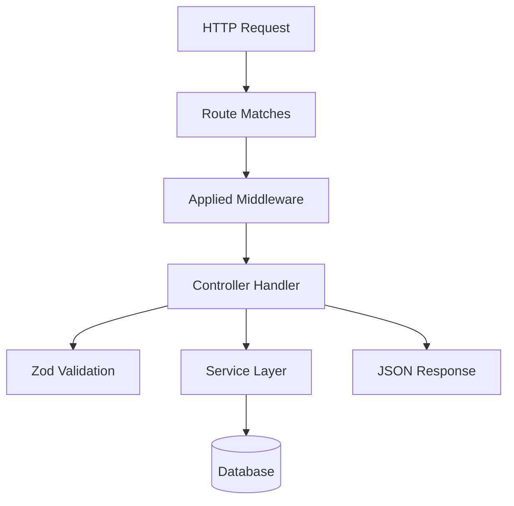

# 20. Knowledge Transfer Guide

## Day 1 — Foundation

### What to Learn First

1. **Project Purpose**: Read `README.md` and this guide
2. **Tech Stack**: Node.js + Express + Neon + Drizzle + Docker
3. **Code Flow**: Start at `src/index.js` → `src/server.js` → `src/app.js`
4. **Key Files** (read these first):
   - `src/app.js` — Full middleware and route configuration
   - `src/controllers/auth.controller.js` — Auth flow
   - `src/middleware/auth.middleware.js` — Auth mechanism
   - `src/services/auth.service.js` — Business logic

5. **Run the project**:
   ```bash
   npm install
   npm run dev:docker  # if Docker is available
   # or
   npm run dev  # if you have a local PostgreSQL
   ```

6. **Test the API**:
   ```bash
   curl http://localhost:3000/health
   curl http://localhost:3000/api
   ```

### What Can Be Ignored Initially

- `DOCKER_SETUP.md` — Detailed Docker reference (read later)
- `WARP.md` — Warp terminal configuration (optional)
- `.editorconfig`, `.prettierrc` — Formatting config
- CI/CD workflow files — Read before deploying
- `drizzle/meta/` — Migration metadata (auto-generated)
- `coverage/` — Generated test reports

## Day 3 — Core Understanding

### Module Interactions

Understand how requests flow through the system:



### Key Patterns to Understand

| Pattern | Files | Key Takeaway |
|---------|-------|-------------|
| Controller-Service separation | `controllers/*`, `services/*` | Controllers handle HTTP; services handle logic |
| Middleware chain | `middleware/*`, `app.js` | Cross-cutting concerns (auth, security) applied before routes |
| Import maps | `package.json` | `#` aliases for clean imports |
| Zod validation | `validations/*` | Schema-based input validation with parsing |
| Error handling | All controllers | try-catch with status-specific error responses |

### Database Understanding

- Single table: `users`
- Fields: id, name, email, password (bcrypt), role, timestamps
- Interactions via Drizzle ORM (not raw SQL)
- Migrations managed via Drizzle Kit

## Day 7 — Advanced Topics

### Security Architecture

1. **Defense layers** (in order):
   - Helmet (headers)
   - CORS (origin restriction)
   - Arcjet Shield (attack detection)
   - Arcjet Bot Detection
   - Arcjet Rate Limiting
   - Zod Validation (input)
   - JWT Authentication (identity)
   - Role Authorization (permissions)

2. **JWT flow**: Sign → Store in httpOnly cookie → Verify on each request

3. **Rate limiting**: Role-based tiers (admin: 20/min, user: 10/min, guest: 5/min)

### Infrastructure

1. **Docker multi-stage**: Base (prod deps) → Dev (all deps + hot-reload) / Prod (minimal)
2. **Neon**: Local proxy for dev, Cloud for prod
3. **CI/CD**: GitHub Actions for lint → test → build → push

### Testing Strategy

Current tests are minimal (3 health checks). Key areas needing tests:
- Auth flows (signup, signin, signout)
- User CRUD operations
- Auth middleware (no token, invalid token, role checks)
- Security middleware (rate limits, bot detection)

## Day 30 — Ownership

### Critical Knowledge Areas

| Area | Why Important | Key Files |
|------|---------------|-----------|
| **Auth security** | Core of the system, security-critical | `auth.middleware.js`, `security.middleware.js`, `jwt.js` |
| **Docker deployment** | Production delivery mechanism | `Dockerfile`, `docker-compose.prod.yml` |
| **CI/CD pipeline** | Release automation | `.github/workflows/` |
| **Database schema** | Foundation for future features | `user.model.js`, `drizzle/` |
| **Error handling** | Production reliability | All controller files |

### Production Concerns

1. **Never commit `.env` with secrets** — Already a concern (rotate credentials)
2. **JWT rotation** — No refresh token flow exists
3. **Database scaling** — No pagination on user list
4. **Logging volume** — Winston logs to files without rotation
5. **Monitoring** — Only health endpoint, no metrics

### Who to Go To For Help

| Topic | Resource |
|-------|----------|
| JavaScript Mastery tutorials | YouTube channel |
| Express 5 docs | expressjs.com |
| Drizzle ORM | orm.drizzle.team |
| Neon DB | neon.tech/docs |
| Arcjet | arcjet.com/docs |
| Docker | docs.docker.com |
| GitHub Actions | docs.github.com/actions |

### Key Contacts

- **Project maintainer**: JavaScript Mastery team
- **Arcjet support**: Arcjet Discord (for security questions)
- **Neon support**: Neon Discord (for database questions)

## Critical Files Summary

```mermaid
graph TB
    subgraph "Must-Know Files"
        App["src/app.js"]
        AuthCtrl["src/controllers/auth.controller.js"]
        UserCtrl["src/controllers/users.controller.js"]
        AuthMW["src/middleware/auth.middleware.js"]
        SecMW["src/middleware/security.middleware.js"]
        AuthSvc["src/services/auth.service.js"]
        UserSvc["src/services/users.service.js"]
        Model["src/models/user.model.js"]
    end
    
    subgraph "Configuration Files"
        Logger["src/config/logger.js"]
        DB["src/config/database.js"]
        Arcjet["src/config/arcjet.js"]
        JWT["src/utils/jwt.js"]
    end
    
    subgraph "Infrastructure Files"
        Docker["Dockerfile"]
        DevCompose["docker-compose.dev.yml"]
        ProdCompose["docker-compose.prod.yml"]
    end
    
    App --> AuthCtrl
    App --> UserCtrl
    App --> AuthMW
    App --> SecMW
    AuthCtrl --> AuthSvc
    UserCtrl --> UserSvc
    UserSvc --> Model
    AuthSvc --> Model
    AuthSvc --> DB
    UserSvc --> DB
    SecMW --> Arcjet
    AuthMW --> JWT
