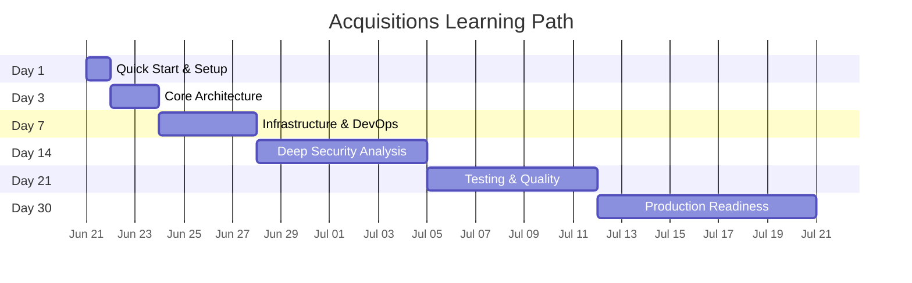

# Repository Learning Path

## Day 1 — Quick Start

**Goal**: Run the project and understand the basics.

### Activities

- [ ] Read `README.md`
- [ ] Install dependencies: `npm install`
- [ ] Start the app: `npm run dev` (with local DB) or `npm run dev:docker`
- [ ] Test all endpoints with curl
- [ ] Read `src/app.js` — understand middleware and routes

### Key Files

- `src/app.js`, `src/server.js`, `src/index.js`

### Checkpoint

- Can register a user and get a token
- Can access protected routes with the token
- Understand the middleware stack order

---

## Day 3 — Core Architecture

**Goal**: Understand the complete request lifecycle and data flow.

### Activities

- [ ] Read all controllers (`src/controllers/`)
- [ ] Read all services (`src/services/`)
- [ ] Read auth middleware (`src/middleware/auth.middleware.js`)
- [ ] Read security middleware (`src/middleware/security.middleware.js`)
- [ ] Read database config (`src/config/database.js`)
- [ ] Read JWT utils (`src/utils/jwt.js`)
- [ ] Read cookie utils (`src/utils/cookies.js`)
- [ ] Trace a full sign-in request through every layer

### Key Concepts

- Controller-Service separation
- Middleware chain execution order
- JWT generation → cookie setting → cookie reading → verification
- Role-based authorization flow

### Checkpoint

- Can explain the full lifecycle of a sign-in request
- Can trace a protected request through auth middleware
- Understand how rate limiting applies per role

---

## Day 7 — Infrastructure & DevOps

**Goal**: Understand Docker, CI/CD, and deployment.

### Activities

- [ ] Read `Dockerfile` — understand multi-stage build
- [ ] Read `docker-compose.dev.yml`
- [ ] Read `docker-compose.prod.yml`
- [ ] Read CI/CD workflows (`.github/workflows/`)
- [ ] Read `scripts/dev.sh`, `scripts/prod.sh`
- [ ] Build Docker image locally
- [ ] Run Docker compose locally

### Key Concepts

- Multi-stage Docker builds (base → dev/prod)
- Neon Local vs Neon Cloud
- CI/CD pipeline: lint → test → build → push
- Multi-architecture builds (amd64 + arm64)

### Checkpoint

- Can build and run the Docker image
- Understand the CI/CD pipeline flow
- Can explain the difference between dev and prod Docker setups

---

## Day 14 — Deep Security Analysis

**Goal**: Understand all security layers and their interactions.

### Activities

- [ ] Read Arcjet config (`src/config/arcjet.js`)
- [ ] Read security middleware in detail
- [ ] Trace JWT cookie attributes
- [ ] Identify security gaps
- [ ] Read Zod validation schemas
- [ ] Read all error handling patterns

### Key Concepts

- Defense in depth: 8 security layers
- httpOnly cookie + SameSite + Secure
- Rate limiting strategies per role
- Bot detection vs shield vs rate limiting
- Security through error message ambiguity

### Checkpoint

- Can explain all 8 security layers
- Can identify the 2 critical security issues (`.env` committed, JWT fallback)
- Can describe how to fix each issue

---

## Day 21 — Testing & Quality

**Goal**: Understand the testing strategy and quality gaps.

### Activities

- [ ] Read existing tests (`tests/app.test.js`)
- [ ] Read Jest config (`jest.config.mjs`)
- [ ] Run tests: `npm test`
- [ ] Review coverage reports (`coverage/`)
- [ ] Write 3 new tests (e.g., signup, signin, auth middleware)
- [ ] Read ESLint config
- [ ] Run lint: `npm run lint`

### Key Concepts

- SuperTest for HTTP integration testing
- Jest ESM configuration (`--experimental-vm-modules`)
- Coverage thresholds
- Test quality vs test quantity

### Checkpoint

- Understand why current tests are insufficient
- Can write a basic integration test
- Know how to run lint and fix issues

---

## Day 30 — Production Readiness

**Goal**: Evaluate and prepare the project for production.

### Activities

- [ ] Review all ADRs
- [ ] Review technical debt report
- [ ] Evaluate security: fix `.env` and JWT fallback
- [ ] Add pagination to user list
- [ ] Add database connection pooling
- [ ] Add error handler middleware
- [ ] Add graceful shutdown
- [ ] Document production deployment steps

### Key Concepts

- Production hardening checklist
- Database scaling considerations
- Logging and monitoring requirements
- Incident response procedures

### Checkpoint

- Can deploy the application to production
- Have addressed the critical security issues
- Can explain all architectural decisions and tradeoffs
- Ready to extend the system with new features

## Learning Path Summary

