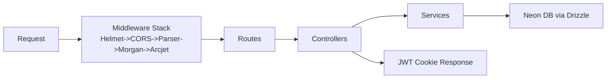

# 19. Onboarding Guide

## Project Overview

**Acquisitions** is a production-ready REST API for user authentication and management. It provides:

- User registration, login, and logout
- Role-based access control (admin/user)
- User profile CRUD operations
- Security: rate limiting, bot detection, helmet headers
- Docker-based development and deployment

**Tech Stack**: Node.js, Express 5, Neon PostgreSQL, Drizzle ORM, Arcjet, Docker

## Prerequisites

- Node.js 18+ (20.x recommended)
- npm 9+
- Docker Desktop
- Git
- A code editor (VS Code recommended)
- A Neon Cloud account (for production database)

## Setup Steps

### 1. Clone and Install

```bash
git clone <repository-url>
cd acquisitions
npm install
```

### 2. Environment Configuration

Create `.env.development`:

```bash
# Server Configuration
PORT=3000
NODE_ENV=development
LOG_LEVEL=info

# Database Configuration (Neon Local — runs in Docker)
DATABASE_URL=postgresql://neon@localhost:5432/neondb

# Arcjet (get free key from arcjet.com)
ARCJET_KEY=ajkey_...

# JWT
JWT_SECRET=your-secure-development-secret
```

Create `.env.production` (when deploying):

```bash
# Server Configuration
PORT=3000
NODE_ENV=production
LOG_LEVEL=info

# Database Configuration
DATABASE_URL=postgresql://... (from Neon Cloud)

# Arcjet
ARCJET_KEY=ajkey_... (production key)

# JWT
JWT_SECRET=your-production-secret
```

### 3. Running Locally

**Option A: With Docker (Recommended)**

```bash
npm run dev:docker
```

This runs `scripts/dev.sh` which:

- Checks for `.env.development`
- Starts Neon Local (PostgreSQL proxy) and the app
- Runs database migrations
- App is available at `http://localhost:3000`

**Option B: Without Docker (Direct)**

```bash
# Ensure you have a PostgreSQL instance running
npm run db:generate   # Generate migration if schema changed
npm run db:migrate    # Apply migrations
npm run dev           # Start with hot-reload
```

### 4. Verify Setup

```bash
# Health check (should return 200)
curl http://localhost:3000/health

# API status
curl http://localhost:3000/api

# Register a user
curl -X POST http://localhost:3000/api/auth/sign-up \
  -H "Content-Type: application/json" \
  -d '{"name":"Test User","email":"test@test.com","password":"test123"}'
```

## Project Structure

```
acquisitions/
├── src/
│   ├── index.js              # Entry point
│   ├── server.js             # Server boot
│   ├── app.js                # Express app config
│   ├── config/               # DB, logger, Arcjet config
│   ├── controllers/          # Request handlers
│   ├── middleware/            # Auth, security
│   ├── models/               # Drizzle schemas
│   ├── routes/               # Route definitions
│   ├── services/             # Business logic
│   ├── utils/                # JWT, cookies, format
│   └── validations/          # Zod schemas
├── tests/                    # Test suite
├── drizzle/                  # Database migrations
├── scripts/                  # Dev/prod shell scripts
├── Dockerfile                # Multi-stage build
├── docker-compose.dev.yml    # Dev environment
└── docker-compose.prod.yml   # Prod environment
```

## Available Scripts

| Command                | Description                   |
| ---------------------- | ----------------------------- |
| `npm start`            | Production start              |
| `npm run dev`          | Development with hot-reload   |
| `npm test`             | Run tests                     |
| `npm run lint`         | Lint check                    |
| `npm run lint:fix`     | Auto-fix lint issues          |
| `npm run format`       | Format with Prettier          |
| `npm run format:check` | Check formatting              |
| `npm run db:generate`  | Generate Drizzle migration    |
| `npm run db:migrate`   | Apply migrations              |
| `npm run db:studio`    | Open Drizzle Studio           |
| `npm run dev:docker`   | Start Docker dev environment  |
| `npm run prod:docker`  | Start Docker prod environment |

## Import Aliases

The project uses Node.js subpath imports via `package.json`:

```javascript
import logger from '#config/logger.js'; // src/config/logger.js
import authRoutes from '#routes/auth.routes.js'; // src/routes/auth.routes.js
import { createUser } from '#services/auth.service.js'; // src/services/auth.service.js
```

## Debugging

### VS Code Debug Configuration

Create `.vscode/launch.json`:

```json
{
  "version": "0.2.0",
  "configurations": [
    {
      "type": "node",
      "request": "launch",
      "name": "Debug Acquisitions",
      "skipFiles": ["<node_internals>/**"],
      "program": "${workspaceFolder}/src/index.js",
      "runtimeArgs": ["--experimental-vm-modules"]
    }
  ]
}
```

### Debugging Tests

```bash
node --experimental-vm-modules node_modules/.bin/jest --inspect
```

### Logs

All logs are written to `logs/`:

- `logs/combined.log` — All log levels
- `logs/error.lg` — Error level only

Tail logs in real-time:

```bash
tail -f logs/combined.log
```

## Build Process

The production build is Docker-based:

```bash
docker build --target production -t acquisitions:latest .
```

## Deployment

### Docker Production

```bash
npm run prod:docker
```

### Manual Production

```bash
NODE_ENV=production DATABASE_URL=... JWT_SECRET=... ARCJET_KEY=... npm start
```

## Common Issues

| Issue                           | Cause                                     | Solution                      |
| ------------------------------- | ----------------------------------------- | ----------------------------- |
| `ECONNREFUSED` on DB connection | Neon Local not running                    | Start Docker dev environment  |
| JWT verification fails          | Wrong JWT_SECRET between auth and request | Ensure consistent JWT_SECRET  |
| Rate limit exceeded             | Too many requests in time window          | Wait or check Arcjet config   |
| OAuth/SSO not working           | Not implemented                           | Use sign-up/sign-in endpoints |
| Tests fail with DB errors       | Missing DATABASE_URL in test env          | Set DATABASE_URL for tests    |

## Quick Architecture Reference



## Source Files to Read First

| Order | File                                    | Why                                             |
| ----- | --------------------------------------- | ----------------------------------------------- |
| 1     | `src/app.js`                            | Understand the full middleware stack and routes |
| 2     | `src/controllers/auth.controller.js`    | See auth flow implementation                    |
| 3     | `src/middleware/auth.middleware.js`     | Understand JWT auth and role checks             |
| 4     | `src/middleware/security.middleware.js` | See Arcjet security integration                 |
| 5     | `src/services/auth.service.js`          | Understand business logic                       |
| 6     | `src/models/user.model.js`              | See database schema                             |
| 7     | `Dockerfile`                            | Understand container build                      |
| 8     | `tests/app.test.js`                     | See testing patterns                            |
