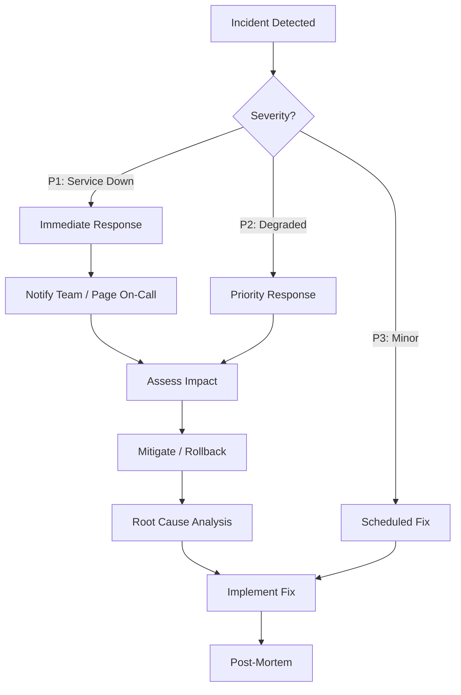

# Production Incident Playbook

## Incident Response Framework



## Incident: Database Down

### Symptoms

- All endpoints return 500 errors
- Logs show `ECONNREFUSED` or connection timeout
- Health check still passes (doesn't check DB connectivity)

### Detection

- Monitoring alert (if configured)
- Log files show database errors
- All API calls fail

### Root Causes

| Cause                        | Probability | Check                                       |
| ---------------------------- | ----------- | ------------------------------------------- |
| Neon Cloud outage            | Low         | Check status.neon.tech                      |
| Connection limit reached     | Medium      | Check Neon dashboard for active connections |
| Database credentials rotated | Medium      | Check DATABASE_URL is current               |
| Network issue                | Low         | Try connecting from another client          |
| Free tier cold start         | Low         | Send a test query to warm up                |

### Immediate Mitigation

1. **Check if DB is reachable**:

   ```bash
   npm install -g neonctl
   neonctl connection-string --project-id <id>
   psql "$DATABASE_URL" -c "SELECT 1"
   ```

2. **Check Neon Status**:
   - Visit: https://status.neon.tech
   - Check: Neon Cloud dashboard

3. **Rollback connection string** to previous known working URL

4. **Consider failover**:
   - If multiplexing, switch to direct connection (or vice versa)
   - Check if `-pooler` suffix helps/hinders

### Recovery

1. Once DB is reachable, verify migrations are applied
2. Run health check
3. Verify a test signup/signin works
4. Resume normal traffic

### Prevention

- Add database connectivity check to health endpoint
- Configure Neon connection pooling
- Set up external monitoring (Pingdom, UptimeRobot)
- Implement circuit breaker pattern for DB calls

## Incident: Cache Down

**Not applicable.** The project does not use caching infrastructure. If Redis/memcached were added in the future, this section would cover cache failure.

## Incident: Auth Failure

### Symptoms

- All authenticated endpoints return 401
- Login attempts fail despite valid credentials
- JWT verification errors in logs

### Detection

- Spike in 401 responses
- Logs: "Authentication error: Failed to authenticate token"
- User reports of being unable to sign in

### Root Causes

| Cause                                      | Probability | Check                                      |
| ------------------------------------------ | ----------- | ------------------------------------------ |
| JWT_SECRET changed (deployment regression) | High        | Compare JWT_SECRET between environments    |
| Cookie changes (domain/path)               | Medium      | Check cookie settings in deployment config |
| Clock skew                                 | Low         | Check server time sync (NTP)               |
| Token expiry algorithm changed             | Low         | Verify JWT config                          |

### Immediate Mitigation

1. **Verify JWT_SECRET is consistent**:
   - Check the secret used to sign tokens matches verification
   - No deployment with secret rotation recently?

2. **Check token manually**:

   ```bash
   # Decode a token (will fail if signed with different secret)
   node -e "const jwt = require('jsonwebtoken'); console.log(jwt.verify(token, secret));"
   ```

3. **Rollback** if secret was recently changed

4. **Force re-login** by clearing all sessions (if possible)

### Recovery

1. Restore consistent JWT_SECRET across all instances
2. Verify token generation and verification works
3. Document secret rotation procedure with overlapping validity windows

### Prevention

- Use JWT secret rotation with two-key overlap (old still valid for 24h)
- Monitor for 401 spikes
- Add integration test that generates and verifies tokens

## Incident: Service Unavailable

### Symptoms

- All requests return 503 or timeout
- Health check fails
- Server not listening on port

### Detection

- Docker health check failure
- Load balancer marks instance as unhealthy
- Monitoring alert

### Root Causes

| Cause                    | Probability | Check                                   |
| ------------------------ | ----------- | --------------------------------------- |
| Out of memory (OOM kill) | Medium      | Check `docker logs`, `dmesg`            |
| Port conflict            | Low         | Check if another process uses port 3000 |
| Node.js crash            | Medium      | Check logs for uncaught exceptions      |
| Disk full (logs)         | Medium      | Check disk space on logs volume         |
| Deployment with errors   | Medium      | Check recent Git changes                |

### Immediate Mitigation

1. **Quick recovery — restart container**:

   ```bash
   docker compose down && docker compose up -d
   ```

2. **Check container status**:

   ```bash
   docker ps -a  # Is container running?
   docker logs acquisitions-app-prod --tail 50
   ```

3. **Check resource usage**:

   ```bash
   docker stats acquisitions-app-prod
   # Check CPU, memory, disk I/O
   ```

4. **Rollback to previous Docker image**:
   ```bash
   docker compose down
   # Edit docker-compose.prod.yml to use previous tag
   docker compose up -d
   ```

### Recovery

1. Identify root cause from logs
2. Apply fix (resource limits, log rotation, etc.)
3. Deploy fix through CI/CD
4. Monitor after fix

### Prevention

- Configure log rotation (Winston transports with maxSize/maxFiles)
- Set Docker resource limits (already configured: 512M mem, 0.5 CPU)
- Add `--restart unless-stopped` (already configured)
- Use process manager (PM2) or Kubernetes for auto-healing

## Incident: High Latency

### Symptoms

- API responses > 2 seconds
- Health check still passes (doesn't measure latency)
- Users report slow performance

### Detection

- Request duration monitoring
- User complaints
- Log timestamps show increasing response times

### Root Causes

| Cause                          | Probability                 | Check                           |
| ------------------------------ | --------------------------- | ------------------------------- |
| Database query slow (no index) | Medium                      | Check query performance in Neon |
| bcrypt under load              | Low (CPU-bound per request) | Check CPU usage                 |
| High concurrent traffic        | Medium                      | Check request rate              |
| External service slow (Arcjet) | Low                         | Check Arcjet status             |
| Memory pressure / GC thrashing | Medium                      | Check Node.js GC logs           |

### Immediate Mitigation

1. **Identify slow requests**:
   Check timestamps in `logs/combined.log` to identify pattern

2. **Check database query performance**:

   ```sql
   EXPLAIN ANALYZE SELECT * FROM users WHERE email = 'test@test.com';
   ```

3. **Scale up**:
   - Increase Docker CPU/memory limits
   - Add more container replicas (behind load balancer)

4. **Temporarily reduce rate limits** to shed load

### Prevention

- Add query performance monitoring
- Implement database query timeout
- Add connection pooling
- Consider adding Redis cache for frequent queries

## Incident: Memory Leak

### Symptoms

- Container restarts periodically
- Memory usage grows over time
- Eventually OOM killed

### Detection

- `docker stats` shows memory growth
- Logs show abrupt process termination

### Root Causes

| Cause                           | Check                                |
| ------------------------------- | ------------------------------------ |
| Unclosed database connections   | Check connection pool size over time |
| Winston log buffer accumulation | Check if logs are being flushed      |
| Closure/reference leaks         | Heap dump analysis                   |
| Large payload parsing           | Check request sizes                  |

### Immediate Mitigation

1. **Restart container** (temporary fix):

   ```bash
   docker compose restart app
   ```

2. **Take heap snapshot**:

   ```bash
   node -e "global.gc(); console.log(process.memoryUsage())"
   ```

3. **Check for leaks**:
   Monitor memory over 30 minutes

### Recovery

1. Profile with `--inspect` and Chrome DevTools
2. Fix identified leak
3. Deploy and monitor

### Prevention

- Regular container restarts (k8s liveness probe)
- Memory limit hard cap (already: 512M)
- Load testing before deployment

## Incident: Deployment Rollback

### Symptoms

- Deployment introduced bugs or regressions

### Procedure

1. **Identify the bad deployment**:

   ```bash
   git log --oneline -10
   ```

2. **Revert code**:

   ```bash
   git revert HEAD
   git push origin main
   ```

3. **Rollback Docker image**:

   ```bash
   # In docker-compose.prod.yml
   # Change: image: user/app:latest
   # To: image: user/app:<previous-working-tag>
   docker compose down
   docker compose up -d
   ```

4. **Rollback database** (if migration was applied):

   ```bash
   npm run db:migrate  # Drizzle Kit handles down migrations
   # Or manually revert migration SQL
   ```

5. **Verify**:
   ```bash
   curl http://localhost:3000/health
   # Run smoke tests
   ```

### Database Rollback Specific

If a bad migration was applied:

```bash
# Drizzle Kit migration down (if available)
npx drizzle-kit migrate:down

# Or manually
psql "$DATABASE_URL" -c "DROP TABLE IF EXISTS users;"
# Then apply previous migration
npx drizzle-kit migrate
```
