# 26. Production Readiness Assessment

## Overall Score: 5.6/10

### Score Breakdown

| Category            | Score | Justification                                                         |
| ------------------- | ----- | --------------------------------------------------------------------- |
| **Architecture**    | 7/10  | Clean layered architecture, good separation of concerns, import maps  |
| **Security**        | 5/10  | Good defense-in-depth but critical credential exposure                |
| **Scalability**     | 6/10  | Stateless JWT + Docker, but missing pagination and connection pooling |
| **Maintainability** | 7/10  | Well-organized code, good linting, but minimal tests                  |
| **Observability**   | 3/10  | Logging only, no metrics, tracing, or alerting                        |
| **Testing**         | 2/10  | 3 basic tests, 0% coverage of core logic                              |
| **Reliability**     | 5/10  | Health checks and restart, but no graceful shutdown                   |

### Go/No-Go Decision

| Criteria                  | Status     | Notes                                                |
| ------------------------- | ---------- | ---------------------------------------------------- |
| Security issues resolved? | ❌ NO      | Credentials in `.env`, JWT fallback, CORS permissive |
| Test coverage adequate?   | ❌ NO      | Only 3 tests                                         |
| Monitoring configured?    | ❌ NO      | No metrics, alerting, or dashboards                  |
| Error handling complete?  | ⚠️ PARTIAL | Try-catch in controllers, but no error middleware    |
| Documentation sufficient? | ✅ YES     | README, DOCKER_SETUP, comprehensive docs             |

**Production Verdict**: NOT READY — Must fix security issues and add basic test coverage.

### Production Critical Path

```mermaid
flowchart LR
    subgraph "Must Fix (Blocking)"
        A1["Remove .env from Git"]
        A2["Rotate All Credentials"]
        A3["Fix JWT Secret Fallback"]
        A4["Configure CORS Origins"]
    end

    subgraph "Strongly Recommended"
        B1["Add Auth Integration Tests"]
        B2["Add Database Error Handler"]
        B3["Configure Log Rotation"]
        B4["Add Graceful Shutdown"]
    end

    subgraph "Nice to Have"
        C1["Add Pagination"]
        C2["Add Metrics Endpoint"]
        C3["Add Connection Pooling"]
        C4["Add Email Verification"]
    end

    A1 --> A2 --> A3 --> A4
    A4 --> B1 --> B2
    B2 --> B3 --> B4
    B4 --> C1 --> C2
    C2 --> C3 --> C4
```

## Production Risks

| Risk                                | Probability | Impact   | Mitigation                          |
| ----------------------------------- | ----------- | -------- | ----------------------------------- |
| Credential leak via .env            | High        | Critical | Remove from git, rotate secrets     |
| JWT compromise (hardcoded fallback) | Medium      | High     | Remove fallback, enforce env var    |
| Database breach (direct connection) | Medium      | High     | Use network policies, SSL enforced  |
| Rate limit denial of service        | Low         | Medium   | Lower rate limits, add CAPTCHA      |
| No pagination → OOM                 | Medium      | Medium   | Add pagination before 1000 users    |
| Log file disk full                  | Medium      | Medium   | Add log rotation (maxSize/maxFiles) |
| No monitoring → blind to incidents  | High        | Medium   | Add basic uptime monitoring         |

## Source Files Evidence

| Risk                 | File                                    | Line                        |
| -------------------- | --------------------------------------- | --------------------------- |
| .env committed       | `.env`                                  | All                         |
| JWT fallback         | `src/utils/jwt.js`                      | 4                           |
| CORS permissive      | `src/app.js`                            | 8                           |
| No graceful shutdown | `src/server.js`                         | 4 (no signal handlers)      |
| No log rotation      | `src/config/logger.js`                  | 12-13 (no maxSize/maxFiles) |
| Typo in error        | `src/middleware/security.middleware.js` | 28 ("errro")                |
