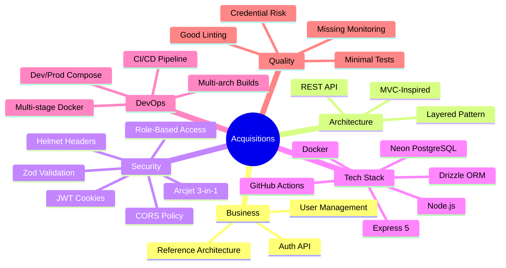

# 28. Repository Intelligence Report

## Most Important Files

| Rank | File                                    | Criticality | Why                                                                   |
| ---- | --------------------------------------- | ----------- | --------------------------------------------------------------------- |
| 1    | `src/app.js`                            | 🔴 Critical | Central Express app — all middleware, routes, and error handling      |
| 2    | `src/services/auth.service.js`          | 🔴 Critical | Core auth logic: password hashing, user creation, authentication      |
| 3    | `src/middleware/auth.middleware.js`     | 🔴 Critical | JWT verification + role authorization — gate for all protected routes |
| 4    | `src/middleware/security.middleware.js` | 🔴 Critical | Arcjet security enforcement — rate limiting, bot detection, shield    |
| 5    | `src/controllers/auth.controller.js`    | 🔴 Critical | Auth request handling — token issuance, cookie management             |
| 6    | `src/services/users.service.js`         | 🟠 High     | User CRUD — all user data operations                                  |
| 7    | `src/config/database.js`                | 🟠 High     | Database connection — all data access depends on this                 |
| 8    | `src/utils/jwt.js`                      | 🟠 High     | Token signing/verification — security-critical                        |
| 9    | `src/models/user.model.js`              | 🟠 High     | Database schema — foundation of all data operations                   |
| 10   | `src/config/arcjet.js`                  | 🟠 High     | Security rules configuration                                          |

## Most Important Modules

| Module              | Files                                                                               | Function                      | Risk if removed                      |
| ------------------- | ----------------------------------------------------------------------------------- | ----------------------------- | ------------------------------------ |
| **Auth**            | `auth.controller.js`, `auth.service.js`, `auth.validation.js`, `auth.routes.js`     | User authentication lifecycle | System loses all auth capability     |
| **Security**        | `security.middleware.js`, `arcjet.config.js`, `auth.middleware.js`                  | Request protection            | System becomes vulnerable to attacks |
| **User Management** | `users.controller.js`, `users.service.js`, `users.validation.js`, `users.routes.js` | User CRUD with authorization  | System cannot manage users           |
| **Infrastructure**  | `database.js`, `logger.js`                                                          | External service connections  | System cannot persist or log         |

## Critical Execution Paths

## Critical Business Logic

| Logic                      | Location                                     | Description                                            | Business Impact                |
| -------------------------- | -------------------------------------------- | ------------------------------------------------------ | ------------------------------ |
| **Password hashing**       | `src/services/auth.service.js:6-9`           | bcrypt.hash with 10 rounds                             | Security of stored credentials |
| **Email uniqueness**       | `src/services/auth.service.js:28-29`         | Check before user creation                             | Prevents duplicate accounts    |
| **JWT generation**         | `src/controllers/auth.controller.js:18`      | Sign with user id, email, role                         | Session establishment          |
| **Rate limit enforcement** | `src/middleware/security.middleware.js:6-12` | Role-based limits per minute                           | API abuse prevention           |
| **Authorization checks**   | `src/controllers/users.controller.js:44-48`  | Self-update, admin-only role change, admin-only delete | Data integrity and security    |

## Critical Dependencies

| Dependency                 | Version        | Purpose          | Risk if removed                         |
| -------------------------- | -------------- | ---------------- | --------------------------------------- |
| `express`                  | ^5.1.0         | HTTP framework   | No API server                           |
| `@arcjet/node`             | ^1.0.0-beta.11 | Security         | No rate limiting, bot detection, shield |
| `@neondatabase/serverless` | ^1.0.1         | Database driver  | No database connection                  |
| `drizzle-orm`              | ^0.44.5        | ORM              | No type-safe database access            |
| `jsonwebtoken`             | ^9.0.2         | JWT              | No authentication                       |
| `bcrypt`                   | ^6.0.0         | Password hashing | Plaintext password storage              |

## Critical Risks

| Risk                   | File                                       | Severity | Mitigation                          |
| ---------------------- | ------------------------------------------ | -------- | ----------------------------------- |
| Credentials committed  | `.env`                                     | Critical | Remove from git, rotate all secrets |
| JWT secret fallback    | `src/utils/jwt.js:4`                       | Critical | Remove fallback, require env var    |
| CORS permissive        | `src/app.js:8`                             | High     | Configure explicit origins          |
| No test coverage       | `tests/`                                   | High     | Add auth + user CRUD tests          |
| No graceful shutdown   | `src/server.js`                            | Medium   | Add SIGTERM/SIGINT handlers         |
| No pagination          | `src/services/users.service.js`            | Medium   | Add LIMIT/OFFSET                    |
| Typo in error response | `src/middleware/security.middleware.js:28` | Low      | Fix "errro" → "error"               |

## Quick Reference

